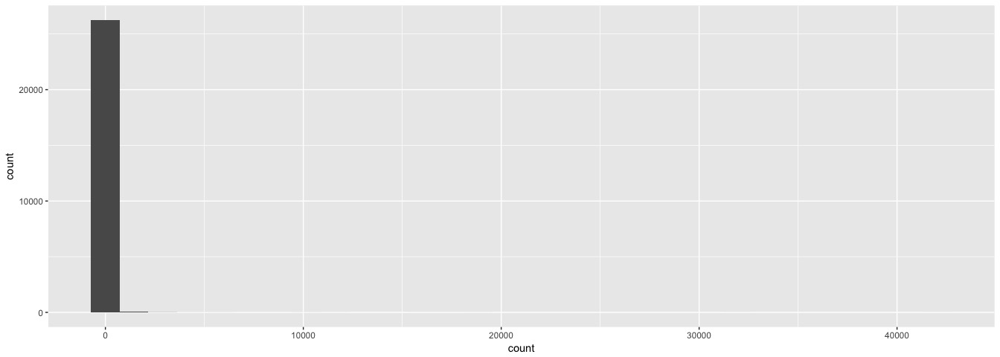
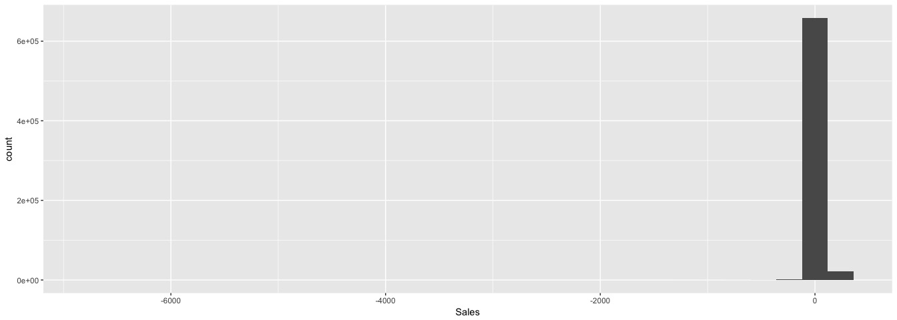
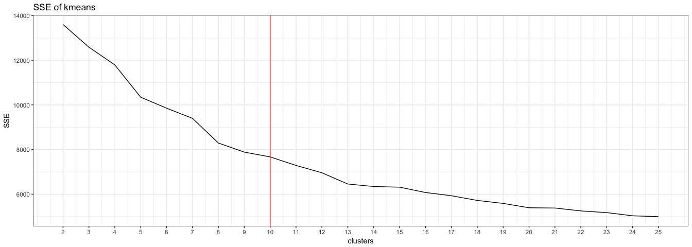
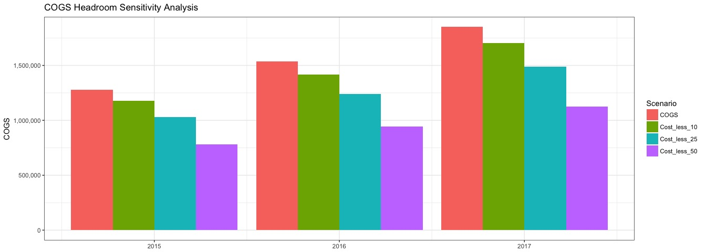

Transactions Clustering
================

-   [Intro](#intro)
    -   [Objective:](#objective)
    -   [Initial questions:](#initial-questions)
    -   [Key Questions (from document)](#key-questions-from-document)
    -   [Method:](#method)
-   [Analysis](#analysis)
    -   [Setup](#setup)
    -   [EDA & Tidy](#eda-tidy)
    -   [EDA of customer profile](#eda-of-customer-profile)
    -   [Creating a customer-level-profile and clustering](#creating-a-customer-level-profile-and-clustering)
    -   [Choosing the best clustering parameters](#choosing-the-best-clustering-parameters)
    -   [Using KMEANS and K=10 to cluster](#using-kmeans-and-k10-to-cluster)
    -   [Examine original groups. Calculate potential headroom](#examine-original-groups.-calculate-potential-headroom)
-   [Output](#output)

Intro
=====

Objective:
----------

Either:

1.  Encourage the fund to invest in this component manufacteruer
2.  Highlight risks and steet company away

Initial questions:
------------------

-   What are potential risks that would steer company away?
-   Customer attrition?
-   Very few customers making up large percentage of purchases (i.e., fragile)

-   Potential Upside?
-   Is there significant $ headroom?
-   Reduce Costs?
-   Is there an optimization solution here in terms of cost of sales?
-   Increase Revenues?
-   Unique characteristics include: components supplied are mission-critical and much cheaper than the final product which is assembled and sold by the customer.
-   Why are the components priced so low compared to the final products?
-   Price driven down by competition rather than margins?
-   Key player in industry, many times larger than competitors. Customers are locked-in by regulations, highly specialized products.
-   Increase cross-selling?

Key Questions (from document)
-----------------------------

1.  Are there distinct customer segments, separate from the end market classifications that have been assigned by the management team?
2.  Inform how we should be thinking about any of the following potential value creation drivers:

-   driving profit by increasing pricing
-   consolidating plant footprint
-   improving how the company purchases raw materials
-   etc.?

1.  If the data raises additional questions or there are additional opportunities for insight, but you would require

-   additional company data
-   external third‐party data, or
-   a conversation with management

please highlight your proposed analyses, their objectives, how they can help influence our decision‐making, and how you would execute them.

Method:
-------

Explore the customer base. Mgmt has classified customers by end market, however, these classifications may be too broad and they may obscure important information. Since the customers are manufactuers who then sell their products to other markets, there is likely a wide variety of customer end-behavior to be explored.

Analysis
========

Document options:

``` r
knitr::opts_chunk$set(
  echo = TRUE,
  message = FALSE,
  warning = FALSE
)
```

Setup
-----

Libraries and data import.

``` r
# libraries:
suppressPackageStartupMessages({
  library(tidyverse)
  library(cluster)
  library(flexclust)
  
  # quickly send data to clipboard (only works on mac)
  toClip <- function(data, sep = '\t', row.names = FALSE){
    clip <- pipe("pbcopy", "w")                       
    write.table(data, file=clip, sep = sep, row.names = row.names)
    close(clip)
  }
  
  # names variables for nicer printing:
  source("utils/rename_variables.R")
  
})
```

Load the data

``` r
transactions <- read_csv("data/Data set A.csv")
customers <- read_csv("data/Data set B.csv")
```

EDA & Tidy
----------

``` r
summary(glimpse(transactions))
```

    ## Observations: 719,252
    ## Variables: 9
    ## $ Plant             <chr> "Site 1", "Site 1", "Site 1", "Site 1", "Sit...
    ## $ FiscalYear        <int> 2015, 2015, 2015, 2015, 2015, 2015, 2015, 20...
    ## $ fiscalyearMonth   <int> 201501, 201501, 201501, 201501, 201501, 2015...
    ## $ Customer          <chr> "Customer 1", "Customer 2", "Customer 3", "C...
    ## $ Part              <chr> "Part 1", "Part 2", "Part 3", "Part 4", "Par...
    ## $ Order             <chr> "Order 1", "Order 2", "Order 3", "Order 4", ...
    ## $ `Sales, $`        <chr> "193.95", "24.975", "197.25", "-55.8", "55.8...
    ## $ `Quantity, units` <int> 200, 20, 1000, -600, 600, 1400, 50, 200, -20...
    ## $ `Part cost, $`    <dbl> 36.3900, 0.2265, 17.7000, 0.0000, 11.5650, 2...

    ##     Plant             FiscalYear   fiscalyearMonth    Customer        
    ##  Length:719252      Min.   :2015   Min.   :201501   Length:719252     
    ##  Class :character   1st Qu.:2015   1st Qu.:201512   Class :character  
    ##  Mode  :character   Median :2016   Median :201609   Mode  :character  
    ##                     Mean   :2016   Mean   :201620                     
    ##                     3rd Qu.:2017   3rd Qu.:201705                     
    ##                     Max.   :2017   Max.   :201712                     
    ##                     NA's   :931    NA's   :931                        
    ##      Part              Order             Sales, $        
    ##  Length:719252      Length:719252      Length:719252     
    ##  Class :character   Class :character   Class :character  
    ##  Mode  :character   Mode  :character   Mode  :character  
    ##                                                          
    ##                                                          
    ##                                                          
    ##                                                          
    ##  Quantity, units      Part cost, $     
    ##  Min.   :-200000.0   Min.   :    0.00  
    ##  1st Qu.:      6.0   1st Qu.:    0.11  
    ##  Median :     36.0   Median :    1.11  
    ##  Mean   :    800.2   Mean   :   17.25  
    ##  3rd Qu.:    300.0   3rd Qu.:   11.12  
    ##  Max.   : 905200.0   Max.   :49328.50  
    ##  NA's   :973         NA's   :931

``` r
summary(glimpse(customers))
```

    ## Observations: 26,391
    ## Variables: 2
    ## $ Customer     <chr> "Customer 1", "Customer 2", "Customer 3", "Custom...
    ## $ `End market` <chr> "Market 1", "Market 1", "Market 1", "Market 1", "...

    ##    Customer          End market       
    ##  Length:26391       Length:26391      
    ##  Class :character   Class :character  
    ##  Mode  :character   Mode  :character

Clean data and join the customer segments to the transactions data, for comparrison. The existing customer "Markets" will form the BAU to compare against our new segmentation.

``` r
trxs_clean <- transactions %>% 
  mutate(Sales = as.numeric(`Sales, $`)) 
```

Any customers have more than 1 market? 65 Customers have &gt;1 Market

``` r
customers %>% 
  group_by(Customer) %>% 
  count() %>% 
  arrange(-n) %>% 
  group_by(n) %>% 
  count(n)
```

    ## # A tibble: 2 x 2
    ## # Groups:   n [2]
    ##       n    nn
    ##   <int> <int>
    ## 1     1 26261
    ## 2     2    65

Solution: Create "market A" and "market B" variables.

``` r
customer_doubles <- customers %>% 
  group_by(Customer) %>% 
  mutate(total_market_segments = n()) %>% 
  filter(total_market_segments>1) %>% 
  arrange(Customer) %>% 
  mutate(market_count = 1
         , market_count_cumsum = cumsum(market_count)) %>% 
  select(-market_count, -total_market_segments) %>% 
  spread(market_count_cumsum, `End market`) %>% 
  rename("Market A" = `1`, "Market B" = `2`)

customers_clean <- customers %>% 
  anti_join(customer_doubles, by = "Customer") %>% 
  rename("Market A" = `End market`) %>% 
  bind_rows(customer_doubles)


# check the row sums:  
nrow(customers_clean) == length(unique(customers$Customer))
```

    ## [1] TRUE

``` r
glimpse(customers_clean)
```

    ## Observations: 26,326
    ## Variables: 3
    ## $ Customer   <chr> "Customer 1", "Customer 2", "Customer 3", "Customer...
    ## $ `Market A` <chr> "Market 1", "Market 1", "Market 1", "Market 1", "Ma...
    ## $ `Market B` <chr> NA, NA, NA, NA, NA, NA, NA, NA, NA, NA, NA, NA, NA,...

Join clean customer data to transaction data

``` r
trxs_joined <- left_join(trxs_clean, customers_clean, by = "Customer")

# check row sums: 
nrow(trxs_joined)==nrow(trxs_clean)
```

    ## [1] TRUE

``` r
summary(glimpse(trxs_joined))
```

    ## Observations: 719,252
    ## Variables: 12
    ## $ Plant             <chr> "Site 1", "Site 1", "Site 1", "Site 1", "Sit...
    ## $ FiscalYear        <int> 2015, 2015, 2015, 2015, 2015, 2015, 2015, 20...
    ## $ fiscalyearMonth   <int> 201501, 201501, 201501, 201501, 201501, 2015...
    ## $ Customer          <chr> "Customer 1", "Customer 2", "Customer 3", "C...
    ## $ Part              <chr> "Part 1", "Part 2", "Part 3", "Part 4", "Par...
    ## $ Order             <chr> "Order 1", "Order 2", "Order 3", "Order 4", ...
    ## $ `Sales, $`        <chr> "193.95", "24.975", "197.25", "-55.8", "55.8...
    ## $ `Quantity, units` <int> 200, 20, 1000, -600, 600, 1400, 50, 200, -20...
    ## $ `Part cost, $`    <dbl> 36.3900, 0.2265, 17.7000, 0.0000, 11.5650, 2...
    ## $ Sales             <dbl> 193.9500, 24.9750, 197.2500, -55.8000, 55.80...
    ## $ `Market A`        <chr> "Market 1", "Market 1", "Market 1", "Market ...
    ## $ `Market B`        <chr> NA, NA, NA, NA, NA, NA, NA, NA, NA, NA, NA, ...

    ##     Plant             FiscalYear   fiscalyearMonth    Customer        
    ##  Length:719252      Min.   :2015   Min.   :201501   Length:719252     
    ##  Class :character   1st Qu.:2015   1st Qu.:201512   Class :character  
    ##  Mode  :character   Median :2016   Median :201609   Mode  :character  
    ##                     Mean   :2016   Mean   :201620                     
    ##                     3rd Qu.:2017   3rd Qu.:201705                     
    ##                     Max.   :2017   Max.   :201712                     
    ##                     NA's   :931    NA's   :931                        
    ##      Part              Order             Sales, $        
    ##  Length:719252      Length:719252      Length:719252     
    ##  Class :character   Class :character   Class :character  
    ##  Mode  :character   Mode  :character   Mode  :character  
    ##                                                          
    ##                                                          
    ##                                                          
    ##                                                          
    ##  Quantity, units      Part cost, $          Sales          
    ##  Min.   :-200000.0   Min.   :    0.00   Min.   :-6770.679  
    ##  1st Qu.:      6.0   1st Qu.:    0.11   1st Qu.:    1.774  
    ##  Median :     36.0   Median :    1.11   Median :    8.100  
    ##  Mean   :    800.2   Mean   :   17.25   Mean   :   41.129  
    ##  3rd Qu.:    300.0   3rd Qu.:   11.12   3rd Qu.:   34.335  
    ##  Max.   : 905200.0   Max.   :49328.50   Max.   :11164.500  
    ##  NA's   :973         NA's   :931        NA's   :1950       
    ##    Market A           Market B        
    ##  Length:719252      Length:719252     
    ##  Class :character   Class :character  
    ##  Mode  :character   Mode  :character  
    ##                                       
    ##                                       
    ##                                       
    ## 

EDA of customer profile
-----------------------

The amount of transations per customer is skewed. a handful of cusotmers have upwards of 4K transactions. Median number of transactions is 4 over a 3 year period (2015-2017).

``` r
trxs_joined %>% 
  group_by(Customer) %>% 
  summarise(count = n()) %>% 
  summary()
```

    ##    Customer             count         
    ##  Length:26327       Min.   :    1.00  
    ##  Class :character   1st Qu.:    2.00  
    ##  Mode  :character   Median :    4.00  
    ##                     Mean   :   27.32  
    ##                     3rd Qu.:   11.00  
    ##                     Max.   :42030.00

``` r
trxs_joined %>% 
  group_by(Customer) %>% 
  summarise(count = n()) %>% 
  ggplot()+
  aes(x = count)+
  geom_histogram()
```



There are clear outliers inthe sales and costs amounts. Filtering out top 5% of trransactions.

``` r
trxs_joined %>% 
  mutate(Sales_percentile = ntile(Sales, 20)) %>% 
  filter(Sales_percentile<20) %>% 
  ggplot()+
  aes(x = Sales)+
  geom_histogram()
```



``` r
trxs_joined <- 
  trxs_joined %>% 
  mutate(Sales_percentile = ntile(Sales, 20)) %>% 
  mutate(Cost_percentile = ntile(`Part cost, $`, 20)) %>% 
  filter(Sales_percentile<20, Cost_percentile < 20, Cost_percentile > 1) 

summary(trxs_joined)
```

    ##     Plant             FiscalYear   fiscalyearMonth    Customer        
    ##  Length:631999      Min.   :2015   Min.   :201501   Length:631999     
    ##  Class :character   1st Qu.:2016   1st Qu.:201601   Class :character  
    ##  Mode  :character   Median :2016   Median :201609   Mode  :character  
    ##                     Mean   :2016   Mean   :201622                     
    ##                     3rd Qu.:2017   3rd Qu.:201705                     
    ##                     Max.   :2017   Max.   :201712                     
    ##                                                                       
    ##      Part              Order             Sales, $        
    ##  Length:631999      Length:631999      Length:631999     
    ##  Class :character   Class :character   Class :character  
    ##  Mode  :character   Mode  :character   Mode  :character  
    ##                                                          
    ##                                                          
    ##                                                          
    ##                                                          
    ##  Quantity, units    Part cost, $        Sales             Market A        
    ##  Min.   :-200000   Min.   : 0.000   Min.   :-5040.000   Length:631999     
    ##  1st Qu.:      6   1st Qu.: 0.135   1st Qu.:    1.674   Class :character  
    ##  Median :     30   Median : 1.012   Median :    7.676   Mode  :character  
    ##  Mean   :    376   Mean   : 7.380   Mean   :   21.025                     
    ##  3rd Qu.:    200   3rd Qu.: 8.187   3rd Qu.:   26.880                     
    ##  Max.   : 200000   Max.   :75.000   Max.   :  178.125                     
    ##  NA's   :10                                                               
    ##    Market B         Sales_percentile Cost_percentile
    ##  Length:631999      Min.   : 1.00    Min.   : 2.00  
    ##  Class :character   1st Qu.: 5.00    1st Qu.: 6.00  
    ##  Mode  :character   Median :10.00    Median :10.00  
    ##                     Mean   :10.05    Mean   :10.35  
    ##                     3rd Qu.:15.00    3rd Qu.:15.00  
    ##                     Max.   :19.00    Max.   :19.00  
    ## 

Creating a customer-level-profile and clustering
------------------------------------------------

What are the dimensions we are interested in?

-   Revenues (Sales)
-   Cost of goods sold
-   How many returns are we making? (Negative sales)
-   Net Sales (Revenues - COGS)
-   Total Volume
-   Seasonality?
-   Different number of parts?
-   Multiple Parts per Order?
-   Order growth QoQ?

``` r
# QUESTION: ARE SALES AND COST FIGURES UNIT PRICES? OR TOTALS?

trxs_features <- trxs_joined %>% 
  mutate(Revenue = Sales # *`Quantity, units`
         , COGS = `Part cost, $` # *`Quantity, units`
         , Count_of_Returns = ifelse(Revenue<0, 1, 0)
         , Total_Returns = ifelse(Revenue<0, Revenue, 0)
         , Profit = Revenue-COGS
  ) %>% 
  group_by(Customer) %>% 
  mutate(Count_of_trxs = n()) %>% 
  ungroup()

trxs_seasonal <- trxs_joined %>% 
  mutate(FiscalMonth = substr(fiscalyearMonth,5,6)
         , FiscalDate = as.Date(paste0(FiscalYear,"-",FiscalMonth,"-01"), format = "%Y-%m-%d")
         , FiscalQuarter = lubridate::quarter(FiscalDate)
         , YearQuarter = as.numeric(paste0(FiscalYear, sprintf("%02.0f",FiscalQuarter)))
  ) %>% 
  select(YearQuarter, FiscalQuarter, Customer, Part, Order, fiscalyearMonth)

trxs_features <- trxs_features %>% left_join(trxs_seasonal, by = c("fiscalyearMonth", "Customer", "Part", "Order"))

glimpse(trxs_features)
```

    ## Observations: 631,999
    ## Variables: 22
    ## $ Plant             <chr> "Site 1", "Site 1", "Site 1", "Site 1", "Sit...
    ## $ FiscalYear        <int> 2015, 2015, 2015, 2015, 2015, 2015, 2015, 20...
    ## $ fiscalyearMonth   <int> 201501, 201501, 201501, 201501, 201501, 2015...
    ## $ Customer          <chr> "Customer 2", "Customer 3", "Customer 3", "C...
    ## $ Part              <chr> "Part 2", "Part 4", "Part 5", "Part 6", "Par...
    ## $ Order             <chr> "Order 2", "Order 5", "Order 6", "Order 7", ...
    ## $ `Sales, $`        <chr> "24.975", "55.8", "123.9", "76.575", "65.7",...
    ## $ `Quantity, units` <int> 20, 600, 1400, 50, 200, 200, 30, 54, 20, 200...
    ## $ `Part cost, $`    <dbl> 0.2265, 11.5650, 25.4100, 4.7070, 5.9100, 6....
    ## $ Sales             <dbl> 24.9750, 55.8000, 123.9000, 76.5750, 65.7000...
    ## $ `Market A`        <chr> "Market 1", "Market 1", "Market 1", "Market ...
    ## $ `Market B`        <chr> NA, NA, NA, NA, NA, NA, NA, NA, NA, NA, NA, ...
    ## $ Sales_percentile  <int> 14, 17, 19, 18, 17, 18, 17, 19, 18, 19, 17, ...
    ## $ Cost_percentile   <int> 7, 16, 18, 13, 14, 14, 13, 18, 17, 19, 17, 1...
    ## $ Revenue           <dbl> 24.9750, 55.8000, 123.9000, 76.5750, 65.7000...
    ## $ COGS              <dbl> 0.2265, 11.5650, 25.4100, 4.7070, 5.9100, 6....
    ## $ Count_of_Returns  <dbl> 0, 0, 0, 0, 0, 0, 0, 0, 0, 0, 0, 0, 0, 0, 0,...
    ## $ Total_Returns     <dbl> 0, 0, 0, 0, 0, 0, 0, 0, 0, 0, 0, 0, 0, 0, 0,...
    ## $ Profit            <dbl> 24.7485, 44.2350, 98.4900, 71.8680, 59.7900,...
    ## $ Count_of_trxs     <int> 4, 59, 59, 1, 5, 5, 1, 467, 467, 81, 81, 81,...
    ## $ YearQuarter       <dbl> 201501, 201501, 201501, 201501, 201501, 2015...
    ## $ FiscalQuarter     <int> 1, 1, 1, 1, 1, 1, 1, 1, 1, 1, 1, 1, 1, 1, 1,...

``` r
# ensures that all quarters a represented (for YoY calculation)
all_quarters <- data_frame(FiscalQuarter = 1:4)

# computes lag from 4 quarters ago (1 year)
lag_1_year <- function(x) lag(x,4)

# computes YoY
Quarterly_YoY <- function(x) {
  y <- (x - lag(x,4))
}

# computes % YoY
Percent_YoY <- function(x) {
  y <- x/lag(x,4)
}

# makes naming and mutli-mutating easier
identity <- function(x) x

# replace NAs and NaNs with 0's if need be
replace_na <- function(x) ifelse(is.na(x), 0, x)
replace_inf <- function(x) ifelse(is.infinite(x), 0, x)

customer_quarterly_averages <- trxs_features %>% 
  arrange(Customer) %>% 
  #filter(Customer %in% c("Customer 1", "Customer 2")) %>%  # dev purposes
  group_by(Customer, YearQuarter, FiscalQuarter) %>% 
  summarise(Quarterly_Volume = sum(`Quantity, units`, na.rm = T)
            , Quarterly_Revenue = sum(Revenue, na.rm = T)
            , Quarterly_Profit = sum(Profit, na.rm = T)
            , Quarterly_COGS = sum(COGS, na.rm = T)
            , Quarterly_count_of_trxs = n()
            , Quarterly_returns = sum(Total_Returns, na.rm = T)
  ) %>% 
  full_join(all_quarters, by = "FiscalQuarter") %>% 
  ungroup() %>% 
  group_by(Customer) %>% 
  arrange(YearQuarter, FiscalQuarter) %>% 
  mutate_at(vars(Quarterly_Volume:Quarterly_returns), funs(lag_1_year, identity)) %>% 
  
  mutate(Quarterly_Volume_yoy = Quarterly_Volume - Quarterly_Volume_lag_1_year
         , Quarterly_Revenue_yoy = Quarterly_Revenue - Quarterly_Revenue_lag_1_year
         , Quarterly_Profit_yoy = Quarterly_Profit - Quarterly_Profit_lag_1_year
         , Quarterly_COGS_yoy = Quarterly_COGS - Quarterly_COGS_lag_1_year
         , Quarterly_count_of_trxs_yoy = Quarterly_count_of_trxs - Quarterly_count_of_trxs_lag_1_year
         , Quarterly_returns_yoy = Quarterly_returns - Quarterly_returns_lag_1_year) %>% 
  
  mutate(Quarterly_Volume_yoy = Quarterly_Volume_yoy/Quarterly_Volume_lag_1_year
         , Quarterly_Revenue_yoy = Quarterly_Revenue_yoy/Quarterly_Revenue_lag_1_year
         , Quarterly_Profit_yoy = Quarterly_Profit_yoy/Quarterly_Profit_lag_1_year
         , Quarterly_COGS_yoy = Quarterly_COGS_yoy/Quarterly_COGS_lag_1_year
         , Quarterly_count_of_trxs_yoy = Quarterly_count_of_trxs_yoy/Quarterly_count_of_trxs_lag_1_year
         , Quarterly_returns_yoy = Quarterly_returns_yoy/Quarterly_returns_lag_1_year) %>% 
  select(-contains("identity"),-contains("lag_1_year")) %>% 
  rowwise() %>% 
  mutate_at(vars(Quarterly_Volume:Quarterly_returns_yoy), function(x) ifelse(is.nan(x),NA,x)) %>% 
  ungroup() %>% 
  group_by(Customer) %>% 
  summarise_at(vars(Quarterly_Volume:Quarterly_returns_yoy), funs(mean), na.rm = T) %>% 
  mutate_at(vars(Quarterly_Volume:Quarterly_returns_yoy), function(x) ifelse(is.nan(x),NA,x))


# what percent volume each quarter?
quarterly_buying_habits <- trxs_features %>% 
  group_by(Customer, FiscalYear, FiscalQuarter) %>% 
  summarise(total_quarterly_volume = sum(`Quantity, units`, na.rm = T)) %>% 
  ungroup() %>% 
  group_by(Customer, FiscalQuarter) %>% 
  summarise(Average_quarterly_volume = mean(total_quarterly_volume, na.rm = T)
            , total_quarterly_volume = sum(total_quarterly_volume, na.rm = T)) %>% 
  mutate(total_volume = sum(total_quarterly_volume, na.rm = T)) %>% 
  mutate(Percent_Sold_In_Quarter = total_quarterly_volume/total_volume) %>% 
  select(Customer, FiscalQuarter, Percent_Sold_In_Quarter) %>% 
  spread(FiscalQuarter, Percent_Sold_In_Quarter) %>% 
  mutate_all(funs(replace_na))

quarterly_buying_habits <- quarterly_buying_habits %>% 
  select(Customer, "Percent Q1" = `1`,"Percent Q2" = `2`,"Percent Q3" = `3`,"Percent Q4" = `4`)

# join all customer level data
cluster_data <- left_join(customer_quarterly_averages,  quarterly_buying_habits, by = "Customer")
```

Choosing the best clustering parameters
---------------------------------------

Normalize data by scaling

``` r
data_for_scaling <- cluster_data %>% 
  ungroup() %>% 
  mutate_if(is.numeric,funs(replace_na)) %>% 
  mutate_if(is.numeric, replace_inf)

scaled_data <-  data_for_scaling %>% 
  mutate_at(vars(Quarterly_Volume:`Percent Q4`), scale) %>% 
  select_at(vars(Quarterly_Volume:`Percent Q4`))
```

Using the elbow method, we find that around 10 clusters is optimal.

``` r
fc_cont <- new("flexclustControl")
fc_cont@tolerance <- 0.1
fc_cont@iter.max <- 30
fc_cont@verbose <- 0
fc_family <- "kmeans"

# for loop to determine best K
kmin <- 2
kmax <- 25
plot_sse <- data_frame()

for(i in kmin:kmax){
  number_clusters <- i
  print(paste0("trying ", i, " clusters"))
  
  
  set.seed(2018)
  cluster_data_test <- sample_frac(scaled_data, 0.2)
  
  clustered <- kcca(cluster_data_test
                    , k = number_clusters
                    , save.data = TRUE
                    , control = fc_cont
                    , family = kccaFamily(fc_family))
  
  cluster_data_test$cluster <- clustered@cluster
  
  group_means <- 
    cluster_data_test %>% 
    group_by(cluster) %>% 
    summarise_if(is.numeric,funs(mean), na.rm = T) %>% 
    gather(Var, Y_Bar, -cluster)
  
  SSE <- 
    cluster_data_test %>% 
    gather(Var, Y_actual, -cluster) %>% 
    left_join(group_means) %>% 
    mutate(Error = Y_actual - Y_Bar) %>% 
    summarise(SSE = sum(sqrt(Error^2), na.rm = T)) %>% 
    as.numeric()
  plot_sse <- bind_rows(plot_sse, data_frame(clusters = as.numeric(number_clusters), SSE = SSE))
}
```

    ## [1] "trying 2 clusters"
    ## [1] "trying 3 clusters"
    ## [1] "trying 4 clusters"
    ## [1] "trying 5 clusters"
    ## [1] "trying 6 clusters"
    ## [1] "trying 7 clusters"
    ## [1] "trying 8 clusters"
    ## [1] "trying 9 clusters"
    ## [1] "trying 10 clusters"
    ## [1] "trying 11 clusters"
    ## [1] "trying 12 clusters"
    ## [1] "trying 13 clusters"
    ## [1] "trying 14 clusters"
    ## [1] "trying 15 clusters"
    ## [1] "trying 16 clusters"
    ## [1] "trying 17 clusters"
    ## [1] "trying 18 clusters"
    ## [1] "trying 19 clusters"
    ## [1] "trying 20 clusters"
    ## [1] "trying 21 clusters"
    ## [1] "trying 22 clusters"
    ## [1] "trying 23 clusters"
    ## [1] "trying 24 clusters"
    ## [1] "trying 25 clusters"

``` r
plot_sse %>% 
  ggplot()+
  aes(x = clusters, y = SSE)+
  geom_line()+
  theme_bw()+
  labs(title = "SSE of kmeans")+
  geom_vline(xintercept = 10, col = "red")+
  scale_x_continuous(breaks = 2:25)
```



What family to use? Minimal within-cluster distance is best. Based on within-cluster criteria, kmeans is best choice.

``` r
fc_cont <- new("flexclustControl")
fc_cont@tolerance <- 0.1
fc_cont@iter.max <- 50
fc_cont@verbose <- 0

num_clusters <- 10

set.seed(2018)
cluster_data_test <- sample_frac(scaled_data, 0.2)

set.seed(2018)
test_ngas <- cclust(cluster_data_test
                    , k = num_clusters
                    , method="neuralgas"
                    , save.data=TRUE)

test_kmeans <- cclust(cluster_data_test
                      , k = num_clusters
                      , method="kmeans"
                      , save.data=TRUE)

test_kmedians <- kcca(cluster_data_test
                      , k = num_clusters
                      , save.data = TRUE
                      , control = fc_cont
                      , family = kccaFamily("kmedians")
)
```

``` r
summary(test_ngas)
```

    ## kcca object of family 'kmeans' 
    ## 
    ## call:
    ## cclust(x = cluster_data_test, k = num_clusters, method = "neuralgas", 
    ##     save.data = TRUE)
    ## 
    ## cluster info:
    ##    size    av_dist   max_dist  separation
    ## 1  1793  0.6890345 19.5157390   0.6601962
    ## 2  1189  0.3926189  8.9432273   0.6955815
    ## 3     4 26.5386284 42.3310813  23.8062029
    ## 4   861  0.6673643  7.1346204   1.1318535
    ## 5   811  0.4190011  4.5565483   0.6636284
    ## 6   357  1.8788082 13.7986757   1.0481692
    ## 7     3 19.0067101 27.5318707  22.4058739
    ## 8     1  0.9609997  0.9609997 130.4018389
    ## 9    56  5.1838874 18.7393663   2.4826857
    ## 10    4 14.4175693 28.0972773  14.6423816
    ## 
    ## no convergence after 201 iterations
    ## sum of within cluster distances: 3799.511

``` r
summary(test_kmeans)
```

    ## kcca object of family 'kmeans' 
    ## 
    ## call:
    ## cclust(x = cluster_data_test, k = num_clusters, method = "kmeans", 
    ##     save.data = TRUE)
    ## 
    ## cluster info:
    ##    size    av_dist  max_dist  separation
    ## 1     3 19.0344181 27.433478  23.5314552
    ## 2     4 28.1322713 44.645301  23.0274474
    ## 3     1  0.0000000  0.000000 130.3958729
    ## 4   664  0.4565781 44.889836   1.0486529
    ## 5   751  0.3474390  4.539390   0.6850370
    ## 6   126  3.5303833 18.943604   2.2141593
    ## 7  1147  0.3418301  6.025316   0.7429221
    ## 8  1046  0.9486974  5.411469   0.6087020
    ## 9    87  4.0547463 19.010092   3.2867143
    ## 10 1250  0.3699515  4.405343   0.6346523
    ## 
    ## convergence after 32 iterations
    ## sum of within cluster distances: 3378.174

``` r
summary(test_kmedians)
```

    ## kcca object of family 'kmedians' 
    ## 
    ## call:
    ## kcca(x = cluster_data_test, k = num_clusters, family = kccaFamily("kmedians"), 
    ##     control = fc_cont, save.data = TRUE)
    ## 
    ## cluster info:
    ##    size   av_dist   max_dist separation
    ## 1    69 3.9842922  31.482667  4.2641228
    ## 2   563 0.4721148  61.945854  0.9444514
    ## 3   468 2.5589526 135.513779  0.8616618
    ## 4   424 1.1891329   5.718159  0.8534705
    ## 5   352 4.6040663  98.371196  1.6012281
    ## 6   320 1.1024312   5.782994  0.7455445
    ## 7   335 0.9062349   4.932218  0.6552478
    ## 8   611 0.3304289  10.405900  0.7339944
    ## 9   948 0.3489505  13.787817  0.6419965
    ## 10  989 0.4254654  47.252809  0.7021894
    ## 
    ## convergence after 21 iterations
    ## sum of within cluster distances: 5472.979

Using KMEANS and K=10 to cluster
--------------------------------

``` r
fc_cont <- new("flexclustControl")
fc_cont@tolerance <- 0.1
fc_cont@iter.max <- 50
fc_cont@verbose <- 0

num_clusters <- 10

set.seed(2018)
kmeans_clustering <- kcca(scaled_data
                          , k = num_clusters
                          , save.data = TRUE
                          , control = fc_cont
                          , family = kccaFamily("kmeans"))
```

``` r
cluster_data_groups <- bind_cols(data_for_scaling , data_frame(clusters = kmeans_clustering@cluster))

cluster_data_groups %>% 
  group_by(clusters) %>% 
  count()
```

    ## # A tibble: 10 x 2
    ## # Groups:   clusters [10]
    ##    clusters     n
    ##       <int> <int>
    ##  1        1     8
    ##  2        2    20
    ##  3        3    19
    ##  4        4  5593
    ##  5        5  6491
    ##  6        6  3399
    ##  7        7  3824
    ##  8        8     6
    ##  9        9  5381
    ## 10       10   655

``` r
cluster_groups <- 
  cluster_data_groups %>% 
  group_by(clusters) %>% 
  summarise_if(is.numeric, funs(mean),na.rm = T) %>% 
  mutate_at(vars(Quarterly_Volume:`Percent Q4`), funs(scale)) %>% 
  
  renames_clusters() %>% # found in utile/rename_variables.R
  
  gather(Var, Value, -clusters) %>% 
  ggplot+
  aes(x = Var, y = Value, fill = Value)+
  geom_col()+
  geom_hline(yintercept = 0)+
  coord_flip()+
  facet_wrap(~clusters, nrow = 1)+
  theme_bw()+
  labs(title = "Characteristics of Cluster Groups"
       , y = NULL
       , x = NULL 
       , fill = "Normalized average \n (z-score)")


# colors for variable names
colorpal <- c(
              "darkgreen","darkgreen","darkgreen","darkgreen","darkgreen","darkgreen"
              ,"blue","blue","blue","blue","blue","blue"
              , "red","red","red","red"
              )

cluster_groups <- cluster_groups + theme(axis.text.y=element_text(colour=colorpal))

cluster_groups
```


``` r
market_order <- 
  c("Market 1","Market 2"
    ,"Market 3","Market 4"
    ,"Market 5","Market 6"
    ,"Market 7","Market 8"
    ,"Market 9","Market 10"
    ,"Market 11","Market 12"
    ,"Market 13","Market 14"
    ,"Market 15")

cluster_data_groups %>% 
  left_join(customers, by = "Customer") %>% 
  filter(!is.na(`End market`)) %>% 
  mutate(`End market` =   factor(`End market`, levels = market_order)) %>% 
  group_by(`End market`) %>% 
  count()
```

    ## # A tibble: 15 x 2
    ## # Groups:   End market [15]
    ##    `End market`     n
    ##    <fct>        <int>
    ##  1 Market 1     25101
    ##  2 Market 2        47
    ##  3 Market 3        34
    ##  4 Market 4       123
    ##  5 Market 5        31
    ##  6 Market 6        37
    ##  7 Market 7         7
    ##  8 Market 8        14
    ##  9 Market 9         4
    ## 10 Market 10       11
    ## 11 Market 11       27
    ## 12 Market 12       10
    ## 13 Market 13        4
    ## 14 Market 14        2
    ## 15 Market 15        9

``` r
end_market_groups <- 
  cluster_data_groups %>% 
  left_join(customers, by = "Customer") %>% 
  filter(!is.na(`End market`)) %>% 
  mutate(`End market` =   factor(`End market`, levels = market_order)) %>% 
  group_by(`End market`) %>% 
  summarise_if(is.numeric, funs(mean),na.rm = T) %>% 
  mutate_at(vars(Quarterly_Volume:`Percent Q4`), funs(scale)) %>% 
  renames_clusters() %>% 
  select(-clusters) %>% 
  gather(Var, Value, -`End market`) %>% 
  ggplot+
  aes(x = Var, y = Value, fill = Value)+
  geom_col()+
  geom_hline(yintercept = 0)+
  coord_flip()+
  facet_wrap(~`End market`, nrow = 1)+
  theme_bw()+
  labs(title = "Characteristics of End Market Groups"
       , y = NULL
       , x = NULL 
       , fill = "Normalized average \n (z-score)")

colorpal <- c("darkgreen","darkgreen","darkgreen","darkgreen","darkgreen","darkgreen"
              ,"blue","blue","blue","blue","blue","blue"
              , "red","red","red","red"
              )

end_market_groups <- end_market_groups + theme(axis.text.y=element_text(colour=colorpal))

end_market_groups
```


Examine original groups. Calculate potential headroom
-----------------------------------------------------

If you can move X% of customers to cluster mean, net profit would be Y.

``` r
cluster_mean <- function(x) mean(x, na.rm = T)
cluster_identity <- function(x) sum(x, na.rm = T)

cluster_averages <- cluster_data_groups %>% 
  group_by(clusters) %>% 
  summarise_at(vars(Quarterly_Volume:`Percent Q4`), funs(cluster_mean, cluster_identity)) %>% 
  select(-contains("_identity"))
```

``` r
cluster_compare <- left_join(cluster_data_groups, cluster_averages, by = "clusters")
glimpse(cluster_compare)
```

    ## Observations: 25,396
    ## Variables: 34
    ## $ Customer                                 <chr> "Customer 1", "Custom...
    ## $ Quarterly_Volume                         <dbl> 2357.8182, 4932.1667,...
    ## $ Quarterly_Revenue                        <dbl> 213.59795, 523.11350,...
    ## $ Quarterly_Profit                         <dbl> 188.20336, 340.23025,...
    ## $ Quarterly_COGS                           <dbl> 25.394591, 182.883250...
    ## $ Quarterly_count_of_trxs                  <dbl> 20.272727, 6.750000, ...
    ## $ Quarterly_returns                        <dbl> -5.5800, 0.0000, 0.00...
    ## $ Quarterly_Volume_yoy                     <dbl> 2.6696986, 3.3466037,...
    ## $ Quarterly_Revenue_yoy                    <dbl> 0.5494013, -0.1489215...
    ## $ Quarterly_Profit_yoy                     <dbl> 0.5593369, -0.3451888...
    ## $ Quarterly_COGS_yoy                       <dbl> 0.7179342, 0.2626376,...
    ## $ Quarterly_count_of_trxs_yoy              <dbl> 0.33058974, 0.1396329...
    ## $ Quarterly_returns_yoy                    <dbl> 0, 0, 0, 0, 0, 0, 0, ...
    ## $ `Percent Q1`                             <dbl> 0.11605490, 0.2064339...
    ## $ `Percent Q2`                             <dbl> 0.10741826, 0.4020883...
    ## $ `Percent Q3`                             <dbl> 0.44787168, 0.1836245...
    ## $ `Percent Q4`                             <dbl> 0.3286552, 0.2078532,...
    ## $ clusters                                 <int> 9, 9, 6, 9, 5, 9, 5, ...
    ## $ Quarterly_Volume_cluster_mean            <dbl> 2374.8335, 2374.8335,...
    ## $ Quarterly_Revenue_cluster_mean           <dbl> 155.71945, 155.71945,...
    ## $ Quarterly_Profit_cluster_mean            <dbl> 107.23165, 107.23165,...
    ## $ Quarterly_COGS_cluster_mean              <dbl> 48.487804, 48.487804,...
    ## $ Quarterly_count_of_trxs_cluster_mean     <dbl> 6.428131, 6.428131, 2...
    ## $ Quarterly_returns_cluster_mean           <dbl> -1.3597439, -1.359743...
    ## $ Quarterly_Volume_yoy_cluster_mean        <dbl> 1.19015166, 1.1901516...
    ## $ Quarterly_Revenue_yoy_cluster_mean       <dbl> 0.4523230148, 0.45232...
    ## $ Quarterly_Profit_yoy_cluster_mean        <dbl> 0.4119823761, 0.41198...
    ## $ Quarterly_COGS_yoy_cluster_mean          <dbl> 2.37901124, 2.3790112...
    ## $ Quarterly_count_of_trxs_yoy_cluster_mean <dbl> 0.264030177, 0.264030...
    ## $ Quarterly_returns_yoy_cluster_mean       <dbl> -0.0535004837, -0.053...
    ## $ `Percent Q1_cluster_mean`                <dbl> 0.29126967, 0.2912696...
    ## $ `Percent Q2_cluster_mean`                <dbl> 0.19195315, 0.1919531...
    ## $ `Percent Q3_cluster_mean`                <dbl> 0.253766907, 0.253766...
    ## $ `Percent Q4_cluster_mean`                <dbl> 0.26245276, 0.2624527...

``` r
cluster_delta <- cluster_compare %>% 
  mutate(Quarterly_Volume_delta = Quarterly_Volume - Quarterly_Volume_cluster_mean
         , Quarterly_Revenue_delta = Quarterly_Revenue - Quarterly_Revenue_cluster_mean
         , Quarterly_Profit_delta = Quarterly_Profit - Quarterly_Profit_cluster_mean
         , Quarterly_COGS_delta = Quarterly_COGS - Quarterly_COGS_cluster_mean
         , Quarterly_count_of_trxs_delta = Quarterly_count_of_trxs - Quarterly_count_of_trxs_cluster_mean
         , Quarterly_returns_delta = Quarterly_returns - Quarterly_returns_cluster_mean
         , Quarterly_Volume_yoy_delta = Quarterly_Volume_yoy - Quarterly_Volume_yoy_cluster_mean
         , Quarterly_Revenue_yoy_delta = Quarterly_Revenue_yoy - Quarterly_Revenue_yoy_cluster_mean
         , Quarterly_Profit_yoy_delta = Quarterly_Profit_yoy - Quarterly_Profit_yoy_cluster_mean
         , Quarterly_COGS_yoy_delta  = Quarterly_Profit_yoy - Quarterly_Profit_yoy_cluster_mean
         , Quarterly_count_of_trxs_yoy_delta = Quarterly_count_of_trxs_yoy - Quarterly_count_of_trxs_yoy_cluster_mean
         , Quarterly_returns_yoy_delta = Quarterly_returns_yoy - Quarterly_returns_yoy_cluster_mean
         , `Percent Q1_delta` = `Percent Q1` - `Percent Q1_cluster_mean`
         , `Percent Q2_delta` = `Percent Q2` - `Percent Q2_cluster_mean`
         , `Percent Q3_delta` = `Percent Q3` - `Percent Q3_cluster_mean`
         , `Percent Q4_delta` = `Percent Q4` - `Percent Q2_cluster_mean`
  )
```

Can we increase Quarterly\_Profit of individual customers? Which customers can be adjusted up?

Top customers below cluster mean

``` r
cluster_delta %>% filter(Quarterly_Profit>0) %>%  top_n(10, desc(Quarterly_Profit_delta)) %>% select(Customer, "Average Quarterly Profit" = Quarterly_Profit, Quarterly_Profit_cluster_mean, Quarterly_Profit_delta) %>% toClip()


cluster_delta %>% filter(Quarterly_Profit>0) %>%  top_n(10, desc(Quarterly_Profit_delta)) %>% select(Customer, "Average Quarterly Profit" = Quarterly_Profit, Quarterly_Profit_cluster_mean, Quarterly_Profit_delta) 
```

    ## # A tibble: 10 x 4
    ##    Customer       `Average Quarterly… Quarterly_Profit_… Quarterly_Profit…
    ##    <chr>                        <dbl>              <dbl>             <dbl>
    ##  1 Customer 10569                19.6                433             - 413
    ##  2 Customer 11669                40.4                361             - 321
    ##  3 Customer 126               13422                20595             -7173
    ##  4 Customer 12692                69.7                361             - 292
    ##  5 Customer 21670             18175                20595             -2420
    ##  6 Customer 243               13192                20595             -7402
    ##  7 Customer 6108                 99.9                361             - 262
    ##  8 Customer 6118                 51.0                361             - 310
    ##  9 Customer 76                20256                20595             - 339
    ## 10 Customer 8197                169                  361             - 193

Revenue and costs adjustment for under-performing Customers

``` r
customer_revenue_adjust <- 
  cluster_delta %>% 
  select(Customer, Quarterly_Revenue, Quarterly_Revenue_delta) %>% 
  filter(Quarterly_Revenue>0) %>% 
  filter(Quarterly_Revenue_delta<0) %>% 
  mutate(Revenue_adjust_10 = 0.1
         ,Revenue_adjust_25 = 0.25
         ,Revenue_adjust_50 = 0.50)

customer_cost_adjust <- 
  cluster_delta %>% 
  select(Customer, Quarterly_COGS, Quarterly_COGS_delta) %>% 
  filter(Quarterly_COGS_delta>0) %>% 
  mutate(Cost_adjust_10 = 0.1
         , Cost_adjust_25 = 0.25
         , Cost_adjust_50 = 0.50)
```

``` r
trxs_joined_revenue_adjustments <- left_join(trxs_joined, customer_revenue_adjust, by = "Customer")


trxs_joined_revenue_adjustments %>% 
  mutate(Revenue = Sales#*`Quantity, units`
  ) %>% 
  mutate_at(vars(Revenue_adjust_10:Revenue_adjust_50), funs(replace_na)) %>% 
  mutate(Revenue_add_10 = Revenue+(Revenue_adjust_10*Revenue)
         , Revenue_add_25 = Revenue+(Revenue_adjust_25*Revenue)
         , Revenue_add_50 = Revenue+(Revenue_adjust_50*Revenue)
  ) %>% 
  group_by(FiscalYear) %>% 
  summarise(Revenue = sum(Revenue, na.rm = T)
            , Revenue_add_10 = sum(Revenue_add_10, na.rm = T)
            , Revenue_add_25 = sum(Revenue_add_25, na.rm = T)
            , Revenue_add_50 = sum(Revenue_add_50, na.rm = T)
  ) %>% 
  filter(!is.na(FiscalYear)) %>% toClip()

revenue_headroom_barchart <- 
  trxs_joined_revenue_adjustments %>% 
  mutate(Revenue = Sales#*`Quantity, units`
  ) %>% 
  mutate_at(vars(Revenue_adjust_10:Revenue_adjust_50), funs(replace_na)) %>% 
  mutate(Revenue_add_10 = Revenue+(Revenue_adjust_10*Revenue)
         , Revenue_add_25 = Revenue+(Revenue_adjust_25*Revenue)
         , Revenue_add_50 = Revenue+(Revenue_adjust_50*Revenue)
  ) %>% 
  group_by(FiscalYear) %>% 
  summarise(Revenue = sum(Revenue, na.rm = T)
            , Revenue_add_10 = sum(Revenue_add_10, na.rm = T)
            , Revenue_add_25 = sum(Revenue_add_25, na.rm = T)
            , Revenue_add_50 = sum(Revenue_add_50, na.rm = T)
  ) %>% 
  filter(!is.na(FiscalYear)) %>% 
  gather(Var, Value, -FiscalYear) %>% 
  ggplot()+
  aes(x = FiscalYear, y = Value, fill = Var, group = Var)+
  geom_col(position = "dodge")+
  theme_bw()+
  scale_y_continuous(labels = scales::comma)+
  labs(title = "Revenue Headroom Sensitivity Analysis"
       , x = NULL
       , y = "Revenue"
       , fill = "Scenario")

revenue_headroom_barchart
```


``` r
trxs_joined_cost_adjustments <- left_join(trxs_joined, customer_cost_adjust, by = "Customer")

trxs_joined_cost_adjustments %>% 
  mutate(COGS = `Part cost, $`#*`Quantity, units`
  ) %>% 
  mutate_at(vars(Cost_adjust_10:Cost_adjust_50), funs(replace_na)) %>% 
  mutate(Cost_add_10 = COGS-(Cost_adjust_10*COGS)
         , Cost_add_25 = COGS-(Cost_adjust_25*COGS)
         , Cost_add_50 = COGS-(Cost_adjust_50*COGS)
  ) %>% 
  group_by(FiscalYear) %>% 
  summarise(COGS = sum(COGS, na.rm = T)
            , Cost_less_10 = sum(Cost_add_10, na.rm = T)
            , Cost_less_25 = sum(Cost_add_25, na.rm = T)
            , Cost_less_50 = sum(Cost_add_50, na.rm = T)
  ) %>% 
  filter(!is.na(FiscalYear)) %>% toClip()


cogs_headroom_barchart <- 
  trxs_joined_cost_adjustments %>% 
  mutate(COGS = `Part cost, $`#*`Quantity, units`
  ) %>% 
  mutate_at(vars(Cost_adjust_10:Cost_adjust_50), funs(replace_na)) %>% 
  mutate(Cost_add_10 = COGS-(Cost_adjust_10*COGS)
         , Cost_add_25 = COGS-(Cost_adjust_25*COGS)
         , Cost_add_50 = COGS-(Cost_adjust_50*COGS)
  ) %>% 
  group_by(FiscalYear) %>% 
  summarise(COGS = sum(COGS, na.rm = T)
            , Cost_less_10 = sum(Cost_add_10, na.rm = T)
            , Cost_less_25 = sum(Cost_add_25, na.rm = T)
            , Cost_less_50 = sum(Cost_add_50, na.rm = T)
  ) %>% 
  filter(!is.na(FiscalYear)) %>% 
  gather(Var, Value, -FiscalYear) %>% 
  ggplot()+
  aes(x = FiscalYear, y = Value, fill = Var, group = Var)+
  geom_col(position = "dodge")+
  theme_bw()+
  scale_y_continuous(labels = scales::comma)+
  labs(title = "COGS Headroom Sensitivity Analysis"
       , x = NULL
       , y = "COGS"
       , fill = "Scenario")

cogs_headroom_barchart
```



Output
======

``` r
# cluster groups:
jpeg(filename = "img/cluster-groups.png", width = 10, height = 4, units = "in", res = 1000)
cluster_groups
dev.off()
```

    ## pdf 
    ##   2

``` r
# end market groups:
jpeg(filename = "img/end-market-groups.png", width = 10, height = 4, units = "in", res = 1000)
end_market_groups
dev.off()
```

    ## pdf 
    ##   2

``` r
# top 10 customers by profit delta:
cluster_delta %>% 
  ungroup() %>% 
  filter(Quarterly_Profit>0) %>%  
  arrange(Quarterly_Profit_delta) %>%
  head(10) %>% 
  select(Customer
         , "Average Quarterly Profit" = Quarterly_Profit
         , Quarterly_Profit_cluster_mean, Quarterly_Profit_delta) %>% 
  toClip()


# revenue headroom barchart:
jpeg(filename = "img/revenue-headroom-barchart.png", width = 10, height = 4, units = "in", res = 1000)
revenue_headroom_barchart
dev.off()
```

    ## pdf 
    ##   2

``` r
# revenue headroom data:
trxs_joined_revenue_adjustments %>% 
  mutate(Revenue = Sales#*`Quantity, units`
  ) %>% 
  mutate_at(vars(Revenue_adjust_10:Revenue_adjust_50), funs(replace_na)) %>% 
  mutate(Revenue_add_10 = Revenue+(Revenue_adjust_10*Revenue)
         , Revenue_add_25 = Revenue+(Revenue_adjust_25*Revenue)
         , Revenue_add_50 = Revenue+(Revenue_adjust_50*Revenue)
  ) %>% 
  group_by(FiscalYear) %>% 
  summarise(Revenue = sum(Revenue, na.rm = T)
            , Revenue_add_10 = sum(Revenue_add_10, na.rm = T)
            , Revenue_add_25 = sum(Revenue_add_25, na.rm = T)
            , Revenue_add_50 = sum(Revenue_add_50, na.rm = T)
  ) %>% 
  filter(!is.na(FiscalYear)) %>% toClip()


# COGS headroom barchart:
jpeg(filename = "img/cogs-headroom-barchart.png", width = 10, height = 4, units = "in", res = 1000)
cogs_headroom_barchart
dev.off()
```

    ## pdf 
    ##   2

``` r
# COGS headroom data:
trxs_joined_cost_adjustments %>% 
  mutate(COGS = `Part cost, $`#*`Quantity, units`
  ) %>% 
  mutate_at(vars(Cost_adjust_10:Cost_adjust_50), funs(replace_na)) %>% 
  mutate(Cost_add_10 = COGS-(Cost_adjust_10*COGS)
         , Cost_add_25 = COGS-(Cost_adjust_25*COGS)
         , Cost_add_50 = COGS-(Cost_adjust_50*COGS)
  ) %>% 
  group_by(FiscalYear) %>% 
  summarise(COGS = sum(COGS, na.rm = T)
            , Cost_less_10 = sum(Cost_add_10, na.rm = T)
            , Cost_less_25 = sum(Cost_add_25, na.rm = T)
            , Cost_less_50 = sum(Cost_add_50, na.rm = T)
  ) %>% 
  filter(!is.na(FiscalYear)) %>% toClip()

# averages by cluster
cluster_data_groups %>% 
  group_by(clusters) %>% 
  summarise_if(is.numeric, funs(mean), na.rm = T) %>% 
  left_join(
    cluster_data_groups %>% 
      group_by(clusters) %>% 
      summarise(count = n()) 
    , by = "clusters"
  ) %>% 
  select(clusters, count, everything()) %>% 
  renames_clusters() %>% # RENAMING VARIABLES FOR NICE PRINTING
  t() %>% toClip(row.names = TRUE)
```
