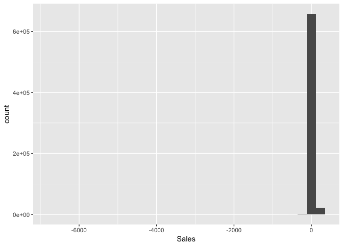
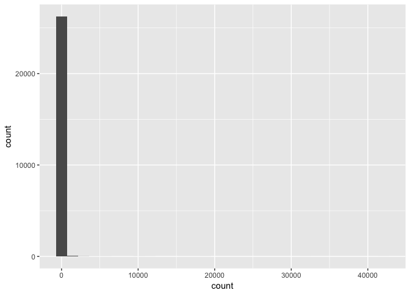
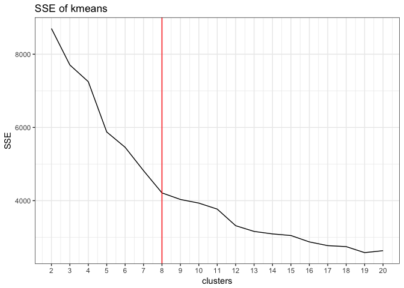
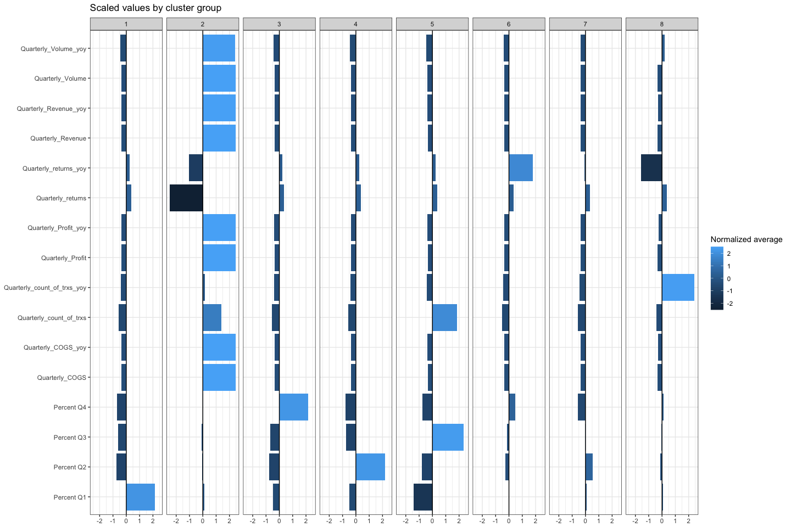
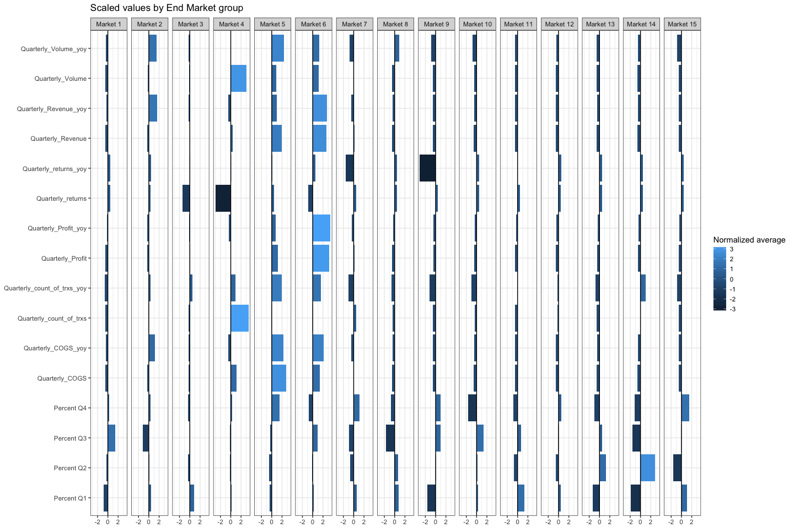
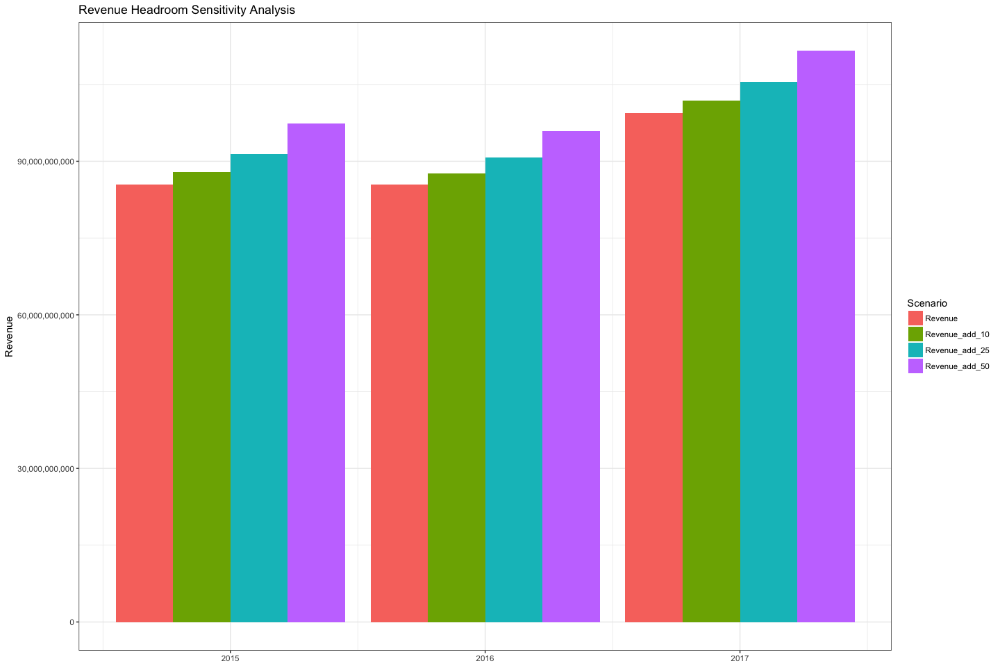
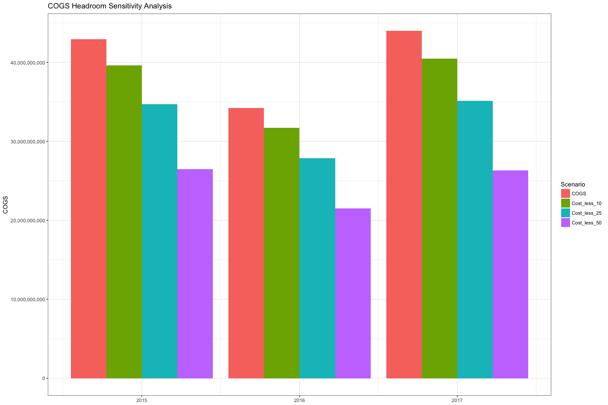

Transactions Clustering
================

Intro
=====

Objective:
----------

Either:

1.  Encourage the fund to invest in this component manufacteruer
2.  Highlight risks and steet company away

Initial questions:
------------------

-   What are potential risks that would steer company away?
-   Customer attrition?
-   Very few customers making up large percentage of purchases (i.e., fragile)

-   Potential Upside?
-   Is there significant $ headroom?
-   Reduce Costs?
-   Is there an optimization solution here in terms of cost of sales?
-   Increase Revenues?
-   Unique characteristics include: components supplied are mission-critical and much cheaper than the final product which is assembled and sold by the customer.
-   Why are the components priced so low compared to the final products?
-   Price driven down by competition rather than margins?
-   Key player in industry, many times larger than competitors. Customers are locked-in by regulations, highly specialized products.
-   Increase cross-selling?

Key Questions (from document)
-----------------------------

1.  Are there distinct customer segments, separate from the end market classifications that have been assigned by the management team?
2.  Inform how we should be thinking about any of the following potential value creation drivers:

-   driving profit by increasing pricing
-   consolidating plant footprint
-   improving how the company purchases raw materials
-   etc.?

1.  If the data raises additional questions or there are additional opportunities for insight, but you would require
    -   additional company data
    -   external third‐party data, or
    -   a conversation with management

please highlight your proposed analyses, their objectives, how they can help influence our decision‐making, and how you would execute them.

Method:
-------

Explore the customer base. Mgmt has classified customers by end market, however, these classifications may be too broad and they may obscure important information. Since the customers are manufactuers who then sell their products to other markets, there is likely a wide variety of customer end-behavior to be explored.

Analysis
========

Document options:

``` r
knitr::opts_chunk$set(
  echo = TRUE,
  message = FALSE,
  warning = FALSE
)
```

Setup
-----

Libraries and data import.

``` r
# libraries:
suppressPackageStartupMessages({
  library(tidyverse)
  library(cluster)
  
  source("~/toClip.R") # quickly send data to clipboard on mac
})
```

Load the data

``` r
transactions <- read_csv("data/Data set A.csv")
customers <- read_csv("data/Data set B.csv")
```

EDA & Tidy
----------

``` r
summary(glimpse(transactions))
```

    ## Observations: 719,252
    ## Variables: 9
    ## $ Plant             <chr> "Site 1", "Site 1", "Site 1", "Site 1", "Sit...
    ## $ FiscalYear        <int> 2015, 2015, 2015, 2015, 2015, 2015, 2015, 20...
    ## $ fiscalyearMonth   <int> 201501, 201501, 201501, 201501, 201501, 2015...
    ## $ Customer          <chr> "Customer 1", "Customer 2", "Customer 3", "C...
    ## $ Part              <chr> "Part 1", "Part 2", "Part 3", "Part 4", "Par...
    ## $ Order             <chr> "Order 1", "Order 2", "Order 3", "Order 4", ...
    ## $ `Sales, $`        <chr> "193.95", "24.975", "197.25", "-55.8", "55.8...
    ## $ `Quantity, units` <int> 200, 20, 1000, -600, 600, 1400, 50, 200, -20...
    ## $ `Part cost, $`    <dbl> 36.3900, 0.2265, 17.7000, 0.0000, 11.5650, 2...

    ##     Plant             FiscalYear   fiscalyearMonth    Customer        
    ##  Length:719252      Min.   :2015   Min.   :201501   Length:719252     
    ##  Class :character   1st Qu.:2015   1st Qu.:201512   Class :character  
    ##  Mode  :character   Median :2016   Median :201609   Mode  :character  
    ##                     Mean   :2016   Mean   :201620                     
    ##                     3rd Qu.:2017   3rd Qu.:201705                     
    ##                     Max.   :2017   Max.   :201712                     
    ##                     NA's   :931    NA's   :931                        
    ##      Part              Order             Sales, $        
    ##  Length:719252      Length:719252      Length:719252     
    ##  Class :character   Class :character   Class :character  
    ##  Mode  :character   Mode  :character   Mode  :character  
    ##                                                          
    ##                                                          
    ##                                                          
    ##                                                          
    ##  Quantity, units      Part cost, $     
    ##  Min.   :-200000.0   Min.   :    0.00  
    ##  1st Qu.:      6.0   1st Qu.:    0.11  
    ##  Median :     36.0   Median :    1.11  
    ##  Mean   :    800.2   Mean   :   17.25  
    ##  3rd Qu.:    300.0   3rd Qu.:   11.12  
    ##  Max.   : 905200.0   Max.   :49328.50  
    ##  NA's   :973         NA's   :931

``` r
summary(glimpse(customers))
```

    ## Observations: 26,391
    ## Variables: 2
    ## $ Customer     <chr> "Customer 1", "Customer 2", "Customer 3", "Custom...
    ## $ `End market` <chr> "Market 1", "Market 1", "Market 1", "Market 1", "...

    ##    Customer          End market       
    ##  Length:26391       Length:26391      
    ##  Class :character   Class :character  
    ##  Mode  :character   Mode  :character

Clean data and join the customer segments to the transactions data, for comparrison. The existing customer "Markets" will form the BAU to compare against our new segmentation.

``` r
trxs_clean <- transactions %>% 
  mutate(Sales = as.numeric(`Sales, $`)) 
```

Any customers have more than 1 market? 65 Customers have &gt;1 Market

``` r
customers %>% 
  group_by(Customer) %>% 
  count() %>% 
  arrange(-n) %>% 
  group_by(n) %>% 
  count(n)
```

    ## # A tibble: 2 x 2
    ## # Groups:   n [2]
    ##       n    nn
    ##   <int> <int>
    ## 1     1 26261
    ## 2     2    65

Solution: Create "market A" and "market B" variables.

``` r
customer_doubles <- customers %>% 
  group_by(Customer) %>% 
  mutate(total_market_segments = n()) %>% 
  filter(total_market_segments>1) %>% 
  arrange(Customer) %>% 
  mutate(market_count = 1
         , market_count_cumsum = cumsum(market_count)) %>% 
  select(-market_count, -total_market_segments) %>% 
  spread(market_count_cumsum, `End market`) %>% 
  rename("Market A" = `1`, "Market B" = `2`)

customers_clean <- customers %>% 
  anti_join(customer_doubles, by = "Customer") %>% 
  rename("Market A" = `End market`) %>% 
  bind_rows(customer_doubles)


# check the row sums:  
nrow(customers_clean) == length(unique(customers$Customer))
```

    ## [1] TRUE

``` r
glimpse(customers_clean)
```

    ## Observations: 26,326
    ## Variables: 3
    ## $ Customer   <chr> "Customer 1", "Customer 2", "Customer 3", "Customer...
    ## $ `Market A` <chr> "Market 1", "Market 1", "Market 1", "Market 1", "Ma...
    ## $ `Market B` <chr> NA, NA, NA, NA, NA, NA, NA, NA, NA, NA, NA, NA, NA,...

Join clean customer data to transaction data

``` r
trxs_joined <- left_join(trxs_clean, customers_clean, by = "Customer")

# check row sums: 
nrow(trxs_joined)==nrow(trxs_clean)
```

    ## [1] TRUE

``` r
summary(glimpse(trxs_joined))
```

    ## Observations: 719,252
    ## Variables: 12
    ## $ Plant             <chr> "Site 1", "Site 1", "Site 1", "Site 1", "Sit...
    ## $ FiscalYear        <int> 2015, 2015, 2015, 2015, 2015, 2015, 2015, 20...
    ## $ fiscalyearMonth   <int> 201501, 201501, 201501, 201501, 201501, 2015...
    ## $ Customer          <chr> "Customer 1", "Customer 2", "Customer 3", "C...
    ## $ Part              <chr> "Part 1", "Part 2", "Part 3", "Part 4", "Par...
    ## $ Order             <chr> "Order 1", "Order 2", "Order 3", "Order 4", ...
    ## $ `Sales, $`        <chr> "193.95", "24.975", "197.25", "-55.8", "55.8...
    ## $ `Quantity, units` <int> 200, 20, 1000, -600, 600, 1400, 50, 200, -20...
    ## $ `Part cost, $`    <dbl> 36.3900, 0.2265, 17.7000, 0.0000, 11.5650, 2...
    ## $ Sales             <dbl> 193.9500, 24.9750, 197.2500, -55.8000, 55.80...
    ## $ `Market A`        <chr> "Market 1", "Market 1", "Market 1", "Market ...
    ## $ `Market B`        <chr> NA, NA, NA, NA, NA, NA, NA, NA, NA, NA, NA, ...

    ##     Plant             FiscalYear   fiscalyearMonth    Customer        
    ##  Length:719252      Min.   :2015   Min.   :201501   Length:719252     
    ##  Class :character   1st Qu.:2015   1st Qu.:201512   Class :character  
    ##  Mode  :character   Median :2016   Median :201609   Mode  :character  
    ##                     Mean   :2016   Mean   :201620                     
    ##                     3rd Qu.:2017   3rd Qu.:201705                     
    ##                     Max.   :2017   Max.   :201712                     
    ##                     NA's   :931    NA's   :931                        
    ##      Part              Order             Sales, $        
    ##  Length:719252      Length:719252      Length:719252     
    ##  Class :character   Class :character   Class :character  
    ##  Mode  :character   Mode  :character   Mode  :character  
    ##                                                          
    ##                                                          
    ##                                                          
    ##                                                          
    ##  Quantity, units      Part cost, $          Sales          
    ##  Min.   :-200000.0   Min.   :    0.00   Min.   :-6770.679  
    ##  1st Qu.:      6.0   1st Qu.:    0.11   1st Qu.:    1.774  
    ##  Median :     36.0   Median :    1.11   Median :    8.100  
    ##  Mean   :    800.2   Mean   :   17.25   Mean   :   41.129  
    ##  3rd Qu.:    300.0   3rd Qu.:   11.12   3rd Qu.:   34.335  
    ##  Max.   : 905200.0   Max.   :49328.50   Max.   :11164.500  
    ##  NA's   :973         NA's   :931        NA's   :1950       
    ##    Market A           Market B        
    ##  Length:719252      Length:719252     
    ##  Class :character   Class :character  
    ##  Mode  :character   Mode  :character  
    ##                                       
    ##                                       
    ##                                       
    ## 

Unique ID is Customer, Part, Order, fiscalyearMonth:

``` r
trxs_joined %>% group_by(Customer, Part, Order, fiscalyearMonth) %>% count() %>% group_by(n) %>% count()
```

    ## # A tibble: 2 x 2
    ## # Groups:   n [2]
    ##       n     nn
    ##   <int>  <int>
    ## 1     1 718321
    ## 2   931      1

EDA of customer profile
-----------------------

The amount of transations per customer is skewed. a handful of cusotmers have upwards of 4K transactions. Median number of transactions is 4 over a 3 year period (2015-2017).

``` r
trxs_joined %>% 
  group_by(Customer) %>% 
  summarise(count = n()) %>% 
  summary()
```

    ##    Customer             count         
    ##  Length:26327       Min.   :    1.00  
    ##  Class :character   1st Qu.:    2.00  
    ##  Mode  :character   Median :    4.00  
    ##                     Mean   :   27.32  
    ##                     3rd Qu.:   11.00  
    ##                     Max.   :42030.00

``` r
trxs_joined %>% 
  group_by(Customer) %>% 
  summarise(count = n()) %>% 
  ggplot()+
  aes(x = count)+
  geom_histogram()
```



``` r
trxs_joined %>% 
  group_by(Customer) %>% 
  summarise(count = n()) %>% 
  summary()
```

    ##    Customer             count         
    ##  Length:26327       Min.   :    1.00  
    ##  Class :character   1st Qu.:    2.00  
    ##  Mode  :character   Median :    4.00  
    ##                     Mean   :   27.32  
    ##                     3rd Qu.:   11.00  
    ##                     Max.   :42030.00

``` r
trxs_joined %>% 
  group_by(Customer) %>% 
  summarise(count = n()) %>% 
  ggplot()+
  aes(x = count)+
  geom_histogram()
```



Creating a customer-level-profile and clustering
------------------------------------------------

What are the dimensions we are interested in? - Revenues (Qty\*Sales) - Cost of goods sold - How many returns are we making? (Negative sales) - Net Sales (Revenues - COGS) - Total Volume - Seasonality? - Different number of parts? - Multiple Parts per Order? - Order growth QoQ?

``` r
trxs_features <- trxs_joined %>% 
  mutate(Revenue = Sales*`Quantity, units`
         , COGS = `Part cost, $`*`Quantity, units`
         , Count_of_Returns = ifelse(Revenue<0, 1, 0)
         , Total_Returns = ifelse(Revenue<0, Revenue, 0)
         , Profit = Revenue-COGS
  ) %>% 
  group_by(Customer) %>% 
  mutate(Count_of_trxs = n()) %>% 
  ungroup()

trxs_seasonal <- trxs_joined %>% 
  mutate(FiscalMonth = substr(fiscalyearMonth,5,6)
         , FiscalDate = as.Date(paste0(FiscalYear,"-",FiscalMonth,"-01"), format = "%Y-%m-%d")
         , FiscalQuarter = lubridate::quarter(FiscalDate)
         , YearQuarter = as.numeric(paste0(FiscalYear, sprintf("%02.0f",FiscalQuarter)))
  ) %>% 
  select(YearQuarter, FiscalQuarter, Customer, Part, Order, fiscalyearMonth)

trxs_features <- trxs_features %>% left_join(trxs_seasonal, by = c("fiscalyearMonth", "Customer", "Part", "Order"))

glimpse(trxs_features)
```

    ## Observations: 1,585,082
    ## Variables: 20
    ## $ Plant             <chr> "Site 1", "Site 1", "Site 1", "Site 1", "Sit...
    ## $ FiscalYear        <int> 2015, 2015, 2015, 2015, 2015, 2015, 2015, 20...
    ## $ fiscalyearMonth   <int> 201501, 201501, 201501, 201501, 201501, 2015...
    ## $ Customer          <chr> "Customer 1", "Customer 2", "Customer 3", "C...
    ## $ Part              <chr> "Part 1", "Part 2", "Part 3", "Part 4", "Par...
    ## $ Order             <chr> "Order 1", "Order 2", "Order 3", "Order 4", ...
    ## $ `Sales, $`        <chr> "193.95", "24.975", "197.25", "-55.8", "55.8...
    ## $ `Quantity, units` <int> 200, 20, 1000, -600, 600, 1400, 50, 200, -20...
    ## $ `Part cost, $`    <dbl> 36.3900, 0.2265, 17.7000, 0.0000, 11.5650, 2...
    ## $ Sales             <dbl> 193.9500, 24.9750, 197.2500, -55.8000, 55.80...
    ## $ `Market A`        <chr> "Market 1", "Market 1", "Market 1", "Market ...
    ## $ `Market B`        <chr> NA, NA, NA, NA, NA, NA, NA, NA, NA, NA, NA, ...
    ## $ Revenue           <dbl> 38790.000, 499.500, 197250.000, 33480.000, 3...
    ## $ COGS              <dbl> 7278.000, 4.530, 17700.000, 0.000, 6939.000,...
    ## $ Count_of_Returns  <dbl> 0, 0, 0, 0, 0, 0, 0, 0, 0, 0, 0, 0, 0, 0, 0,...
    ## $ Total_Returns     <dbl> 0, 0, 0, 0, 0, 0, 0, 0, 0, 0, 0, 0, 0, 0, 0,...
    ## $ Profit            <dbl> 31512.000, 494.970, 179550.000, 33480.000, 2...
    ## $ Count_of_trxs     <int> 234, 5, 240, 240, 240, 240, 1, 23, 23, 23, 2...
    ## $ YearQuarter       <dbl> 201501, 201501, 201501, 201501, 201501, 2015...
    ## $ FiscalQuarter     <int> 1, 1, 1, 1, 1, 1, 1, 1, 1, 1, 1, 1, 1, 1, 1,...

``` r
# ensures that all quarters a represented (for YoY calculation)
all_quarters <- data_frame(FiscalQuarter = 1:4)

lag_1_year <- function(x) lag(x,4)

# function computes YoY
Quarterly_YoY <- function(x) {
  y <- (x - lag(x,4))
}

Percent_YoY <- function(x) {
  y <- x/lag(x,4)
}

# makes naming and mutli-mutating easier
identity <- function(x) x

# replace NAs and NaNs with 0's if need be
replace_na <- function(x) ifelse(is.na(x), 0, x)
replace_inf <- function(x) ifelse(is.infinite(x), 0, x)

customer_quarterly_averages <- trxs_features %>% 
  arrange(Customer) %>% 
  #filter(Customer %in% c("Customer 1", "Customer 2")) %>% 
  group_by(Customer, YearQuarter, FiscalQuarter) %>% 
  summarise(Quarterly_Volume = sum(`Quantity, units`, na.rm = T)
            , Quarterly_Revenue = sum(Revenue, na.rm = T)
            , Quarterly_Profit = sum(Profit, na.rm = T)
            , Quarterly_COGS = sum(COGS, na.rm = T)
            , Quarterly_count_of_trxs = n()
            , Quarterly_returns = sum(Total_Returns, na.rm = T)
  ) %>% 
  full_join(all_quarters, by = "FiscalQuarter") %>% 
  ungroup() %>% 
  group_by(Customer) %>% 
  arrange(YearQuarter, FiscalQuarter) %>% 
  mutate_at(vars(Quarterly_Volume:Quarterly_returns), funs(lag_1_year, identity)) %>% 
  
  mutate(Quarterly_Volume_yoy = Quarterly_Volume - Quarterly_Volume_lag_1_year
         , Quarterly_Revenue_yoy = Quarterly_Revenue - Quarterly_Revenue_lag_1_year
         , Quarterly_Profit_yoy = Quarterly_Profit - Quarterly_Profit_lag_1_year
         , Quarterly_COGS_yoy = Quarterly_COGS - Quarterly_COGS_lag_1_year
         , Quarterly_count_of_trxs_yoy = Quarterly_count_of_trxs - Quarterly_count_of_trxs_lag_1_year
         , Quarterly_returns_yoy = Quarterly_returns - Quarterly_returns_lag_1_year) %>% 
  
  mutate(Quarterly_Volume_yoy = Quarterly_Volume_yoy/Quarterly_Volume_lag_1_year
         , Quarterly_Revenue_yoy = Quarterly_Revenue_yoy/Quarterly_Revenue_lag_1_year
         , Quarterly_Profit_yoy = Quarterly_Profit_yoy/Quarterly_Profit_lag_1_year
         , Quarterly_COGS_yoy = Quarterly_COGS_yoy/Quarterly_COGS_lag_1_year
         , Quarterly_count_of_trxs_yoy = Quarterly_count_of_trxs_yoy/Quarterly_count_of_trxs_lag_1_year
         , Quarterly_returns_yoy = Quarterly_returns_yoy/Quarterly_returns_lag_1_year) %>% 
  select(-contains("identity"),-contains("lag_1_year")) %>% 
  rowwise() %>% 
  mutate_at(vars(Quarterly_Volume:Quarterly_returns_yoy), function(x) ifelse(is.nan(x),NA,x)) %>% 
  ungroup() %>% 
  group_by(Customer) %>% 
  summarise_at(vars(Quarterly_Volume:Quarterly_returns_yoy), funs(mean), na.rm = T) %>% 
  mutate_at(vars(Quarterly_Volume:Quarterly_returns_yoy), function(x) ifelse(is.nan(x),NA,x))


# what percent volume each quarter?
quarterly_buying_habits <- trxs_features %>% 
  group_by(Customer, FiscalYear, FiscalQuarter) %>% 
  summarise(total_quarterly_volume = sum(`Quantity, units`, na.rm = T)) %>% 
  ungroup() %>% 
  group_by(Customer, FiscalQuarter) %>% 
  summarise(Average_quarterly_volume = mean(total_quarterly_volume, na.rm = T)
            , total_quarterly_volume = sum(total_quarterly_volume, na.rm = T)) %>% 
  mutate(total_volume = sum(total_quarterly_volume, na.rm = T)) %>% 
  mutate(Percent_Sold_In_Quarter = total_quarterly_volume/total_volume) %>% 
  select(Customer, FiscalQuarter, Percent_Sold_In_Quarter) %>% 
  spread(FiscalQuarter, Percent_Sold_In_Quarter) %>% 
  mutate_all(funs(replace_na))

names(quarterly_buying_habits) <- c("Customer", "Percent Q1", "Percent Q2", "Percent Q3", "Percent Q4", "Not")
quarterly_buying_habits <- quarterly_buying_habits %>% select(-Not)

# join all customer level data
cluster_data <- left_join(customer_quarterly_averages,  quarterly_buying_habits, by = "Customer")
```

Choosing the best clustering parameters
---------------------------------------

Normalize data

``` r
data_for_scaling <- cluster_data %>% ungroup() %>% mutate_if(is.numeric,funs(replace_na)) %>% mutate_if(is.numeric, replace_inf)
scaled_data <-  data_for_scaling %>% mutate_at(vars(Quarterly_Volume:`Percent Q4`), scale) %>% select_at(vars(Quarterly_Volume:`Percent Q4`))
```

data is too large to do hierarchical clustering quickly. Trying k-centroids instead
===================================================================================

Optimal number clusters? Using the elbow method, we find that around 8 clusters is optimal.

``` r
library(flexclust)
fc_cont <- new("flexclustControl")
fc_cont@tolerance <- 0.1
fc_cont@iter.max <- 30
fc_cont@verbose <- 0
fc_family <- "kmeans"
num_clusters <- 3

# for loop to determine best K
kmin <- 2
kmax <- 20
plot_sse <- data_frame()

for(i in kmin:kmax){
  try_group <- i
  number_clusters <- i
  print(paste0("trying ", i, " clusters"))
  
  
  set.seed(2018)
  cluster_data_test <- sample_frac(scaled_data, 0.2)
  
  clustered <- kcca(cluster_data_test
                    , k = number_clusters
                    , save.data = TRUE
                    , control = fc_cont
                    , family = kccaFamily(fc_family))
  
  cluster_data_test$cluster <- clustered@cluster
  
  group_means <- 
    cluster_data_test %>% 
    group_by(cluster) %>% 
    summarise_if(is.numeric,funs(mean), na.rm = T) %>% 
    gather(Var, Y_Bar, -cluster)
  
  SSE <- 
    cluster_data_test %>% 
    gather(Var, Y_actual, -cluster) %>% 
    left_join(group_means) %>% 
    mutate(Error = Y_actual - Y_Bar) %>% 
    summarise(SSE = sum(sqrt(Error^2), na.rm = T)) %>% 
    as.numeric()
  plot_sse <- bind_rows(plot_sse, data_frame(clusters = as.numeric(number_clusters), SSE = SSE))
}
```

    ## [1] "trying 2 clusters"
    ## [1] "trying 3 clusters"
    ## [1] "trying 4 clusters"
    ## [1] "trying 5 clusters"
    ## [1] "trying 6 clusters"
    ## [1] "trying 7 clusters"
    ## [1] "trying 8 clusters"
    ## [1] "trying 9 clusters"
    ## [1] "trying 10 clusters"
    ## [1] "trying 11 clusters"
    ## [1] "trying 12 clusters"
    ## [1] "trying 13 clusters"
    ## [1] "trying 14 clusters"
    ## [1] "trying 15 clusters"
    ## [1] "trying 16 clusters"
    ## [1] "trying 17 clusters"
    ## [1] "trying 18 clusters"
    ## [1] "trying 19 clusters"
    ## [1] "trying 20 clusters"

``` r
plot_sse %>% 
  ggplot()+
  aes(x = clusters, y = SSE)+
  geom_line()+
  theme_bw()+
  labs(title = "SSE of kmeans")+
  geom_vline(xintercept = 8, col = "red")+
  scale_x_continuous(breaks = 2:20)
```



What family to use? Minimal within-cluster distance is best. Based on within-cluster criteria, kmedians is best choice.

``` r
fc_cont <- new("flexclustControl")
fc_cont@tolerance <- 0.1
fc_cont@iter.max <- 50
fc_cont@verbose <- 0

num_clusters <- 8

set.seed(2018)
cluster_data_test <- sample_frac(scaled_data, 0.2)

set.seed(2018)
test_ngas <- cclust(cluster_data_test
                    , k = num_clusters
                    , method="neuralgas"
                    , save.data=TRUE
)

test_kmeans <- cclust(cluster_data_test
                      , k = num_clusters
                      , method="kmeans"
                      , save.data=TRUE
)

test_kmedians <- kcca(cluster_data_test
                      , k = number_clusters
                      , save.data = TRUE
                      , control = fc_cont
                      , family = kccaFamily("kmedians")
)
```

``` r
summary(test_ngas)
```

    ## kcca object of family 'kmeans' 
    ## 
    ## call:
    ## cclust(x = cluster_data_test, k = num_clusters, method = "neuralgas", 
    ##     save.data = TRUE)
    ## 
    ## cluster info:
    ##   size    av_dist  max_dist  separation
    ## 1    2 13.6451740 13.915149  41.1052360
    ## 2    1  7.1346138  7.134614  41.2487396
    ## 3    1  3.5948529  3.594853 229.1161962
    ## 4  110  1.8238078 12.197477   2.0387922
    ## 5    2 34.3191807 34.340416  70.1816972
    ## 6    5 28.6724352 48.613806  18.6919481
    ## 7 1294  0.3846527  6.986153   0.6912065
    ## 8 3850  0.6311967 21.347787   0.6922328
    ## 
    ## no convergence after 201 iterations
    ## sum of within cluster distances: 3378.487

``` r
summary(test_kmeans)
```

    ## kcca object of family 'kmeans' 
    ## 
    ## call:
    ## cclust(x = cluster_data_test, k = num_clusters, method = "kmeans", 
    ##     save.data = TRUE)
    ## 
    ## cluster info:
    ##   size    av_dist   max_dist separation
    ## 1  666  0.7007180  21.206175  0.3521785
    ## 2 1760  0.3112151 228.981842  0.3386611
    ## 3 1002  0.4311786   3.520868  0.3619075
    ## 4  587  0.6535170 108.497327  0.5437946
    ## 5  294  0.9109567  11.049869  0.8619129
    ## 6   29  2.7018145  14.937626  3.0814366
    ## 7  921  0.1674515  41.014052  0.5291225
    ## 8    6 38.2459633  58.261920 19.9700890
    ## 
    ## convergence after 29 iterations
    ## sum of within cluster distances: 2559.945

``` r
summary(test_kmedians)
```

    ## kcca object of family 'kmedians' 
    ## 
    ## call:
    ## kcca(x = cluster_data_test, k = number_clusters, family = kccaFamily("kmedians"), 
    ##     control = fc_cont, save.data = TRUE)
    ## 
    ## cluster info:
    ##    size     av_dist   max_dist separation
    ## 1    84  1.29776885   5.231678 0.79820166
    ## 2   378  0.32166328   3.540535 0.32140916
    ## 3    89  0.79714902   7.489428 0.33393743
    ## 4   140  0.82582609  20.337789 0.33753987
    ## 5   542  0.35392018 152.630208 0.20284391
    ## 6   652  0.08910617   6.873635 0.09057206
    ## 7    33  9.74304535  86.713262 2.48668041
    ## 8   168  0.71989542   4.182292 0.51764175
    ## 9   144  0.36571839   4.082026 0.40394389
    ## 10   25 11.03159492  61.779345 4.02197409
    ## 11  202  0.81817232  18.256692 0.55499356
    ## 12  124  0.36495931  11.249255 0.15373334
    ## 13  900  0.48087785 323.993051 0.05267479
    ## 14  366  0.40872118   6.588985 0.30566094
    ## 15  114  0.73255562   5.841249 0.38426535
    ## 16  185  0.34660947   9.955535 0.17528322
    ## 17   66  0.29547632   3.665702 0.04925189
    ## 18  762  0.11384249  43.110136 0.03613661
    ## 19  200  0.28505117   2.597311 0.17986397
    ## 20   91  0.19745523   3.627492 0.03427116
    ## 
    ## convergence after 25 iterations
    ## sum of within cluster distances: 2559.771

Using KMEDIANS and K=8 to cluster
---------------------------------

``` r
fc_cont <- new("flexclustControl")
fc_cont@tolerance <- 0.1
fc_cont@iter.max <- 50
fc_cont@verbose <- 0

num_clusters <- 8

set.seed(2018)
kmedians_clustering <- kcca(scaled_data
                          , k = num_clusters
                          , save.data = TRUE
                          , control = fc_cont
                          , family = kccaFamily("kmedians")
)
```

``` r
cluster_data_groups <- bind_cols(data_for_scaling , data_frame(clusters = kmedians_clustering@cluster))

cluster_data_groups %>% 
  group_by(clusters) %>% 
  count()
```

    ## # A tibble: 8 x 2
    ## # Groups:   clusters [8]
    ##   clusters     n
    ##      <int> <int>
    ## 1        1  3410
    ## 2        2    92
    ## 3        3  4848
    ## 4        4  3162
    ## 5        5  5203
    ## 6        6  5117
    ## 7        7  2486
    ## 8        8  2009

``` r
cluster_data_groups %>% 
  group_by(clusters) %>% 
  summarise_if(is.numeric, funs(mean),na.rm = T) %>% 
  mutate_at(vars(Quarterly_Volume:`Percent Q4`), funs(scale)) %>% 
  #select(-YearQuarter, -FiscalQuarter) %>% 
  gather(Var, Value, -clusters) %>% 
  ggplot+
  aes(x = Var, y = Value, fill = Value)+
  geom_col()+
  geom_hline(yintercept = 0)+
  coord_flip()+
  facet_wrap(~clusters, nrow = 1)+
  theme_bw()+
  labs(title = "Scaled values by cluster group"
       , y = NULL
       , x = NULL 
       , fill = "Normalized average")
```



``` r
market_order <- 
c("Market 1","Market 2"
,"Market 3","Market 4"
,"Market 5","Market 6"
,"Market 7","Market 8"
,"Market 9","Market 10"
,"Market 11","Market 12"
,"Market 13","Market 14"
,"Market 15")

cluster_data_groups %>% 
  left_join(customers, by = "Customer") %>% 
  filter(!is.na(`End market`)) %>% 
  mutate(`End market` =   factor(`End market`, levels = market_order)) %>% 
  group_by(`End market`) %>% 
  count()
```

    ## # A tibble: 15 x 2
    ## # Groups:   End market [15]
    ##    `End market`     n
    ##    <fct>        <int>
    ##  1 Market 1     26023
    ##  2 Market 2        47
    ##  3 Market 3        36
    ##  4 Market 4       125
    ##  5 Market 5        33
    ##  6 Market 6        38
    ##  7 Market 7         7
    ##  8 Market 8        14
    ##  9 Market 9         4
    ## 10 Market 10       11
    ## 11 Market 11       28
    ## 12 Market 12       10
    ## 13 Market 13        4
    ## 14 Market 14        2
    ## 15 Market 15        9

``` r
cluster_data_groups %>% 
  left_join(customers, by = "Customer") %>% 
  filter(!is.na(`End market`)) %>% 
  mutate(`End market` =   factor(`End market`, levels = market_order)) %>% 
  group_by(`End market`) %>% 
  summarise_if(is.numeric, funs(mean),na.rm = T) %>% 
  mutate_at(vars(Quarterly_Volume:`Percent Q4`), funs(scale)) %>% 
  select(-clusters) %>% 
  gather(Var, Value, -`End market`) %>% 
  ggplot+
  aes(x = Var, y = Value, fill = Value)+
  geom_col()+
  geom_hline(yintercept = 0)+
  coord_flip()+
  facet_wrap(~`End market`, nrow = 1)+
  theme_bw()+
  labs(title = "Scaled values by End Market group"
       , y = NULL
       , x = NULL 
       , fill = "Normalized average")
```



Examine original groups. Calculate potential headroom
-----------------------------------------------------

If you can move X% of customers to cluster mean, net profit would be Y.

``` r
cluster_mean <- function(x) mean(x, na.rm = T)
cluster_identity <- function(x) sum(x, na.rm = T)
cluster_averages <- cluster_data_groups %>% 
  group_by(clusters) %>% 
  summarise_at(vars(Quarterly_Volume:`Percent Q4`), funs(cluster_mean, cluster_identity)) %>% 
  select(-contains("_identity"))
```

``` r
cluster_compare <- left_join(cluster_data_groups, cluster_averages, by = "clusters")
glimpse(cluster_compare)
```

    ## Observations: 26,327
    ## Variables: 34
    ## $ Customer                                 <chr> "Customer 1", "Custom...
    ## $ Quarterly_Volume                         <dbl> 2178.3333, 11496.3333...
    ## $ Quarterly_Revenue                        <dbl> 85133.9500, 2617399.5...
    ## $ Quarterly_Profit                         <dbl> 73739.0752, 1574208.7...
    ## $ Quarterly_COGS                           <dbl> 11394.8748, 1043190.8...
    ## $ Quarterly_count_of_trxs                  <dbl> 19.500000, 11.333333,...
    ## $ Quarterly_returns                        <dbl> -2.03325, -259.21000,...
    ## $ Quarterly_Volume_yoy                     <dbl> 2.7245710, 1.5688967,...
    ## $ Quarterly_Revenue_yoy                    <dbl> 5.7828499, 3.5917060,...
    ## $ Quarterly_Profit_yoy                     <dbl> 5.7419602, 2.8777062,...
    ## $ Quarterly_COGS_yoy                       <dbl> 9.0151877, 5.9204840,...
    ## $ Quarterly_count_of_trxs_yoy              <dbl> 2.01341687, 0.0324262...
    ## $ Quarterly_returns_yoy                    <dbl> 0, 0, 0, 0, 0, 0, 0, ...
    ## $ `Percent Q1`                             <dbl> 0.12280031, 0.1830148...
    ## $ `Percent Q2`                             <dbl> 0.10657995, 0.2893241...
    ## $ `Percent Q3`                             <dbl> 0.44452946, 0.2659543...
    ## $ `Percent Q4`                             <dbl> 0.3260903, 0.2617066,...
    ## $ clusters                                 <int> 8, 6, 1, 1, 1, 7, 6, ...
    ## $ Quarterly_Volume_cluster_mean            <dbl> 3450.8913, 2205.9231,...
    ## $ Quarterly_Revenue_cluster_mean           <dbl> 1013937.5, 596188.9, ...
    ## $ Quarterly_Profit_cluster_mean            <dbl> 634019.04, 363344.11,...
    ## $ Quarterly_COGS_cluster_mean              <dbl> 380150.36, 233364.23,...
    ## $ Quarterly_count_of_trxs_cluster_mean     <dbl> 12.683273, 5.500163, ...
    ## $ Quarterly_returns_cluster_mean           <dbl> -131.039177, -564.412...
    ## $ Quarterly_Volume_yoy_cluster_mean        <dbl> 9.6780420, 0.9783605,...
    ## $ Quarterly_Revenue_yoy_cluster_mean       <dbl> 141.313660, 45.894736...
    ## $ Quarterly_Profit_yoy_cluster_mean        <dbl> 156.799406, 40.839459...
    ## $ Quarterly_COGS_yoy_cluster_mean          <dbl> 1087.01399, 156.80462...
    ## $ Quarterly_count_of_trxs_yoy_cluster_mean <dbl> 1.5290276059, -0.0213...
    ## $ Quarterly_returns_yoy_cluster_mean       <dbl> -0.0154305625, 0.0129...
    ## $ `Percent Q1_cluster_mean`                <dbl> 0.204926628, 0.180078...
    ## $ `Percent Q2_cluster_mean`                <dbl> 0.212233451, 0.159771...
    ## $ `Percent Q3_cluster_mean`                <dbl> 0.29268834, 0.2530368...
    ## $ `Percent Q4_cluster_mean`                <dbl> 0.290151578, 0.407112...

``` r
cluster_delta <- cluster_compare %>% 
  mutate(Quarterly_Volume_delta = Quarterly_Volume - Quarterly_Volume_cluster_mean
         , Quarterly_Revenue_delta = Quarterly_Revenue - Quarterly_Revenue_cluster_mean
         , Quarterly_Profit_delta = Quarterly_Profit - Quarterly_Profit_cluster_mean
         , Quarterly_COGS_delta = Quarterly_COGS - Quarterly_COGS_cluster_mean
         , Quarterly_count_of_trxs_delta = Quarterly_count_of_trxs - Quarterly_count_of_trxs_cluster_mean
         , Quarterly_returns_delta = Quarterly_returns - Quarterly_returns_cluster_mean
         , Quarterly_Volume_yoy_delta = Quarterly_Volume_yoy - Quarterly_Volume_yoy_cluster_mean
         , Quarterly_Revenue_yoy_delta = Quarterly_Revenue_yoy - Quarterly_Revenue_yoy_cluster_mean
         , Quarterly_Profit_yoy_delta = Quarterly_Profit_yoy - Quarterly_Profit_yoy_cluster_mean
         , Quarterly_COGS_yoy_delta  = Quarterly_Profit_yoy - Quarterly_Profit_yoy_cluster_mean
         , Quarterly_count_of_trxs_yoy_delta = Quarterly_count_of_trxs_yoy - Quarterly_count_of_trxs_yoy_cluster_mean
         , Quarterly_returns_yoy_delta = Quarterly_returns_yoy - Quarterly_returns_yoy_cluster_mean
         , `Percent Q1_delta` = `Percent Q1` - `Percent Q1_cluster_mean`
         , `Percent Q2_delta` = `Percent Q2` - `Percent Q2_cluster_mean`
         , `Percent Q3_delta` = `Percent Q3` - `Percent Q3_cluster_mean`
         , `Percent Q4_delta` = `Percent Q4` - `Percent Q2_cluster_mean`
  )
```

Can we increase Quarterly\_Profit of individual customers? Which customers can be adjusted up?

Top customers below cluster mean

``` r
cluster_delta %>% filter(Quarterly_Profit>0) %>%  top_n(10, desc(Quarterly_Profit_delta)) %>% select(Customer, "Average Quarterly Profit" = Quarterly_Profit, Quarterly_Profit_cluster_mean, Quarterly_Profit_delta) %>% toClip()


cluster_delta %>% filter(Quarterly_Profit>0) %>%  top_n(10, desc(Quarterly_Profit_delta)) %>% select(Customer, "Average Quarterly Profit" = Quarterly_Profit, Quarterly_Profit_cluster_mean, Quarterly_Profit_delta) 
```

    ## # A tibble: 10 x 4
    ##    Customer      `Average Quarterly… Quarterly_Profit_c… Quarterly_Profit…
    ##    <chr>                       <dbl>               <dbl>             <dbl>
    ##  1 Customer 2243             3346865           147017951        -143671087
    ##  2 Customer 2424            12763173           147017951        -134254778
    ##  3 Customer 2578             7186739           147017951        -139831212
    ##  4 Customer 3939            14007406           147017951        -133010546
    ##  5 Customer 4077             1736164           147017951        -145281787
    ##  6 Customer 4865            16478070           147017951        -130539882
    ##  7 Customer 518             14749410           147017951        -132268541
    ##  8 Customer 573              4847317           147017951        -142170634
    ##  9 Customer 577             12863103           147017951        -134154849
    ## 10 Customer 734              9650885           147017951        -137367066

Revenue and costs adjustment for under-performing Customers

``` r
customer_revenue_adjust <- 
  cluster_delta %>% 
  select(Customer, Quarterly_Revenue, Quarterly_Revenue_delta) %>% 
  filter(Quarterly_Revenue>0) %>% 
  filter(Quarterly_Revenue_delta<0) %>% 
  mutate(Revenue_adjust_10 = 0.1
         ,Revenue_adjust_25 = 0.25
         ,Revenue_adjust_50 = 0.50)

customer_cost_adjust <- 
  cluster_delta %>% 
  select(Customer, Quarterly_COGS, Quarterly_COGS_delta) %>% 
  filter(Quarterly_COGS_delta>0) %>% 
  mutate(Cost_adjust_10 = 0.1
         , Cost_adjust_25 = 0.25
         , Cost_adjust_50 = 0.50)
```

``` r
trxs_joined_revenue_adjustments <- left_join(trxs_joined, customer_revenue_adjust, by = "Customer")

trxs_joined_revenue_adjustments %>% 
  mutate(Revenue = Sales*`Quantity, units`) %>% 
  mutate_at(vars(Revenue_adjust_10:Revenue_adjust_50), funs(replace_na)) %>% 
  mutate(Revenue_add_10 = Revenue+(Revenue_adjust_10*Revenue)
         , Revenue_add_25 = Revenue+(Revenue_adjust_25*Revenue)
         , Revenue_add_50 = Revenue+(Revenue_adjust_50*Revenue)
         ) %>% 
  group_by(FiscalYear) %>% 
  summarise(Revenue = sum(Revenue, na.rm = T)
            , Revenue_add_10 = sum(Revenue_add_10, na.rm = T)
            , Revenue_add_25 = sum(Revenue_add_25, na.rm = T)
            , Revenue_add_50 = sum(Revenue_add_50, na.rm = T)
            ) %>% 
  filter(!is.na(FiscalYear)) %>% 
  gather(Var, Value, -FiscalYear) %>% 
  ggplot()+
  aes(x = FiscalYear, y = Value, fill = Var, group = Var)+
  geom_col(position = "dodge")+
  theme_bw()+
  scale_y_continuous(labels = scales::comma)+
  labs(title = "Revenue Headroom Sensitivity Analysis"
       , x = NULL
       , y = "Revenue"
       , fill = "Scenario")
```



``` r
trxs_joined_cost_adjustments <- left_join(trxs_joined, customer_cost_adjust, by = "Customer")

trxs_joined_cost_adjustments %>% 
  mutate(COGS = `Part cost, $`*`Quantity, units`) %>% 
  mutate_at(vars(Cost_adjust_10:Cost_adjust_50), funs(replace_na)) %>% 
  mutate(Cost_add_10 = COGS-(Cost_adjust_10*COGS)
         , Cost_add_25 = COGS-(Cost_adjust_25*COGS)
         , Cost_add_50 = COGS-(Cost_adjust_50*COGS)
         ) %>% 
  group_by(FiscalYear) %>% 
  summarise(COGS = sum(COGS, na.rm = T)
            , Cost_less_10 = sum(Cost_add_10, na.rm = T)
            , Cost_less_25 = sum(Cost_add_25, na.rm = T)
            , Cost_less_50 = sum(Cost_add_50, na.rm = T)
            ) %>% 
  filter(!is.na(FiscalYear)) %>% 
  gather(Var, Value, -FiscalYear) %>% 
  ggplot()+
  aes(x = FiscalYear, y = Value, fill = Var, group = Var)+
  geom_col(position = "dodge")+
  theme_bw()+
  scale_y_continuous(labels = scales::comma)+
  labs(title = "COGS Headroom Sensitivity Analysis"
       , x = NULL
       , y = "COGS"
       , fill = "Scenario")
```


