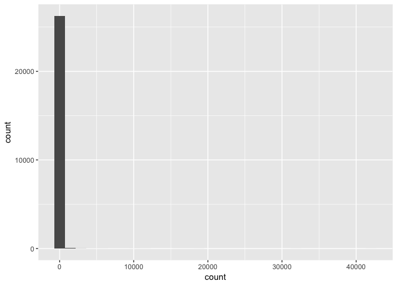

Transactions Clustering
================

Intro
=====

Objective:
----------

Either:

1.  Encourage the fund to invest in this component manufacteruer
2.  Highlight risks and steet company away

Questions:
----------

-   What are potential risks that would steer company away?
    -   Customer attrition?
    -   Very few customers making up large percentage of purchases (i.e., fragile)
    -   

-   Potential Upside?
    -   Is there significant $ headroom?
    -   Reduce Costs?
        -   Is there an optimization solution here in terms of cost of sales?
    -   Increase Revenues?
        -   Unique characteristics include: components supplied are mission-critical and much cheaper than the final product which is assembled and sold by the customer.
        -   Why are the components priced so low compared to the final products?
        -   Price driven down by competition rather than margins?
        -   Key player in industry, many times larger than competitors. Customers are locked-in by regulations, highly specialized products.
        -   Increase cross-selling?

Key Questions (from document)
-----------------------------

1.  Are there distinct customer segments, separate from the end market classifications that have been assigned by the management team?
2.  Inform how we should be thinking about any of the following potential value creation drivers:
    -   driving profit by increasing pricing
    -   consolidating plant footprint
    -   improving how the company purchases raw materials
    -   etc.?
3.  If the data raises additional questions or there are additional opportunities for insight, but you would require
4.  additional company data
5.  external third‐party data, or
6.  a conversation with management

please highlight your proposed analyses, their objectives, how they can help influence our decision‐making, and how you would execute them.

Method:
-------

Explore the customer base. Mgmt has classified customers by end market, however, these classifications may be too broad and they may obscure important information. Since the customers are manufactuers who then sell their products to other markets, there is likely a wide variety of customer end-behavior to be explored.

Analysis
========

Document options:

``` r
knitr::opts_chunk$set(
    echo = TRUE,
    message = FALSE,
    warning = FALSE
)
```

Setup
-----

Libraries and data import.

``` r
# libraries:
suppressPackageStartupMessages(
  library(tidyverse)
)
```

Load the data

``` r
transactions <- read_csv("data/Data set A.csv")
customers <- read_csv("data/Data set B.csv")
```

EDA & Tidy
----------

``` r
summary(glimpse(transactions))
```

    ## Observations: 719,252
    ## Variables: 9
    ## $ Plant             <chr> "Site 1", "Site 1", "Site 1", "Site 1", "Sit...
    ## $ FiscalYear        <int> 2015, 2015, 2015, 2015, 2015, 2015, 2015, 20...
    ## $ fiscalyearMonth   <int> 201501, 201501, 201501, 201501, 201501, 2015...
    ## $ Customer          <chr> "Customer 1", "Customer 2", "Customer 3", "C...
    ## $ Part              <chr> "Part 1", "Part 2", "Part 3", "Part 4", "Par...
    ## $ Order             <chr> "Order 1", "Order 2", "Order 3", "Order 4", ...
    ## $ `Sales, $`        <chr> "193.95", "24.975", "197.25", "-55.8", "55.8...
    ## $ `Quantity, units` <int> 200, 20, 1000, -600, 600, 1400, 50, 200, -20...
    ## $ `Part cost, $`    <dbl> 36.3900, 0.2265, 17.7000, 0.0000, 11.5650, 2...

    ##     Plant             FiscalYear   fiscalyearMonth    Customer        
    ##  Length:719252      Min.   :2015   Min.   :201501   Length:719252     
    ##  Class :character   1st Qu.:2015   1st Qu.:201512   Class :character  
    ##  Mode  :character   Median :2016   Median :201609   Mode  :character  
    ##                     Mean   :2016   Mean   :201620                     
    ##                     3rd Qu.:2017   3rd Qu.:201705                     
    ##                     Max.   :2017   Max.   :201712                     
    ##                     NA's   :931    NA's   :931                        
    ##      Part              Order             Sales, $        
    ##  Length:719252      Length:719252      Length:719252     
    ##  Class :character   Class :character   Class :character  
    ##  Mode  :character   Mode  :character   Mode  :character  
    ##                                                          
    ##                                                          
    ##                                                          
    ##                                                          
    ##  Quantity, units      Part cost, $     
    ##  Min.   :-200000.0   Min.   :    0.00  
    ##  1st Qu.:      6.0   1st Qu.:    0.11  
    ##  Median :     36.0   Median :    1.11  
    ##  Mean   :    800.2   Mean   :   17.25  
    ##  3rd Qu.:    300.0   3rd Qu.:   11.12  
    ##  Max.   : 905200.0   Max.   :49328.50  
    ##  NA's   :973         NA's   :931

``` r
summary(glimpse(customers))
```

    ## Observations: 26,391
    ## Variables: 2
    ## $ Customer     <chr> "Customer 1", "Customer 2", "Customer 3", "Custom...
    ## $ `End market` <chr> "Market 1", "Market 1", "Market 1", "Market 1", "...

    ##    Customer          End market       
    ##  Length:26391       Length:26391      
    ##  Class :character   Class :character  
    ##  Mode  :character   Mode  :character

Clean data and join the customer segments to the transactions data, for comparrison. The existing customer "Markets" will form the BAU to compare against our new segmentation.

``` r
trxs_clean <- transactions %>% 
  mutate(Sales = as.numeric(`Sales, $`)) 
```

Any customers have more than 1 market? 65 Customers have &gt;1 Market

``` r
customers %>% 
  group_by(Customer) %>% 
  count() %>% 
  arrange(-n) %>% 
  group_by(n) %>% 
  count(n)
```

    ## # A tibble: 2 x 2
    ## # Groups:   n [2]
    ##       n    nn
    ##   <int> <int>
    ## 1     1 26261
    ## 2     2    65

Solution: Create "market A" and "market B" variables.

``` r
customer_doubles <- customers %>% 
  group_by(Customer) %>% 
  mutate(total_market_segments = n()) %>% 
  filter(total_market_segments>1) %>% 
  arrange(Customer) %>% 
  mutate(market_count = 1
         , market_count_cumsum = cumsum(market_count)) %>% 
  select(-market_count, -total_market_segments) %>% 
  spread(market_count_cumsum, `End market`) %>% 
  rename("Market A" = `1`, "Market B" = `2`)

customers_clean <- customers %>% 
  anti_join(customer_doubles, by = "Customer") %>% 
  rename("Market A" = `End market`) %>% 
  bind_rows(customer_doubles)


# check the row sums:  
nrow(customers_clean) == length(unique(customers$Customer))
```

    ## [1] TRUE

``` r
glimpse(customers_clean)
```

    ## Observations: 26,326
    ## Variables: 3
    ## $ Customer   <chr> "Customer 1", "Customer 2", "Customer 3", "Customer...
    ## $ `Market A` <chr> "Market 1", "Market 1", "Market 1", "Market 1", "Ma...
    ## $ `Market B` <chr> NA, NA, NA, NA, NA, NA, NA, NA, NA, NA, NA, NA, NA,...

Join clean customer data to transaction data

``` r
trxs_joined <- left_join(trxs_clean, customers_clean, by = "Customer")

# check row sums: 
nrow(trxs_joined)==nrow(trxs_clean)
```

    ## [1] TRUE

``` r
summary(glimpse(trxs_joined))
```

    ## Observations: 719,252
    ## Variables: 12
    ## $ Plant             <chr> "Site 1", "Site 1", "Site 1", "Site 1", "Sit...
    ## $ FiscalYear        <int> 2015, 2015, 2015, 2015, 2015, 2015, 2015, 20...
    ## $ fiscalyearMonth   <int> 201501, 201501, 201501, 201501, 201501, 2015...
    ## $ Customer          <chr> "Customer 1", "Customer 2", "Customer 3", "C...
    ## $ Part              <chr> "Part 1", "Part 2", "Part 3", "Part 4", "Par...
    ## $ Order             <chr> "Order 1", "Order 2", "Order 3", "Order 4", ...
    ## $ `Sales, $`        <chr> "193.95", "24.975", "197.25", "-55.8", "55.8...
    ## $ `Quantity, units` <int> 200, 20, 1000, -600, 600, 1400, 50, 200, -20...
    ## $ `Part cost, $`    <dbl> 36.3900, 0.2265, 17.7000, 0.0000, 11.5650, 2...
    ## $ Sales             <dbl> 193.9500, 24.9750, 197.2500, -55.8000, 55.80...
    ## $ `Market A`        <chr> "Market 1", "Market 1", "Market 1", "Market ...
    ## $ `Market B`        <chr> NA, NA, NA, NA, NA, NA, NA, NA, NA, NA, NA, ...

    ##     Plant             FiscalYear   fiscalyearMonth    Customer        
    ##  Length:719252      Min.   :2015   Min.   :201501   Length:719252     
    ##  Class :character   1st Qu.:2015   1st Qu.:201512   Class :character  
    ##  Mode  :character   Median :2016   Median :201609   Mode  :character  
    ##                     Mean   :2016   Mean   :201620                     
    ##                     3rd Qu.:2017   3rd Qu.:201705                     
    ##                     Max.   :2017   Max.   :201712                     
    ##                     NA's   :931    NA's   :931                        
    ##      Part              Order             Sales, $        
    ##  Length:719252      Length:719252      Length:719252     
    ##  Class :character   Class :character   Class :character  
    ##  Mode  :character   Mode  :character   Mode  :character  
    ##                                                          
    ##                                                          
    ##                                                          
    ##                                                          
    ##  Quantity, units      Part cost, $          Sales          
    ##  Min.   :-200000.0   Min.   :    0.00   Min.   :-6770.679  
    ##  1st Qu.:      6.0   1st Qu.:    0.11   1st Qu.:    1.774  
    ##  Median :     36.0   Median :    1.11   Median :    8.100  
    ##  Mean   :    800.2   Mean   :   17.25   Mean   :   41.129  
    ##  3rd Qu.:    300.0   3rd Qu.:   11.12   3rd Qu.:   34.335  
    ##  Max.   : 905200.0   Max.   :49328.50   Max.   :11164.500  
    ##  NA's   :973         NA's   :931        NA's   :1950       
    ##    Market A           Market B        
    ##  Length:719252      Length:719252     
    ##  Class :character   Class :character  
    ##  Mode  :character   Mode  :character  
    ##                                       
    ##                                       
    ##                                       
    ## 

EDA of customer profile
-----------------------

The amount of transations per customer is skewed. a handful of cusotmers have upwards of 4K transactions. Median number of transactions is 4 over a 3 year period (2015-2017).

``` r
trxs_joined %>% 
  group_by(Customer) %>% 
  summarise(count = n()) %>% 
  summary()
```

    ##    Customer             count         
    ##  Length:26327       Min.   :    1.00  
    ##  Class :character   1st Qu.:    2.00  
    ##  Mode  :character   Median :    4.00  
    ##                     Mean   :   27.32  
    ##                     3rd Qu.:   11.00  
    ##                     Max.   :42030.00

``` r
trxs_joined %>% 
  group_by(Customer) %>% 
  summarise(count = n()) %>% 
  ggplot()+
  aes(x = count)+
  geom_histogram()
```



``` r
trxs_joined %>% 
  group_by(Customer) %>% 
  summarise(count = n()) %>% 
  summary()
```

    ##    Customer             count         
    ##  Length:26327       Min.   :    1.00  
    ##  Class :character   1st Qu.:    2.00  
    ##  Mode  :character   Median :    4.00  
    ##                     Mean   :   27.32  
    ##                     3rd Qu.:   11.00  
    ##                     Max.   :42030.00

``` r
trxs_joined %>% 
  group_by(Customer) %>% 
  summarise(count = n()) %>% 
  ggplot()+
  aes(x = count)+
  geom_histogram()
```


Creating a customer-profile and clustering
------------------------------------------
